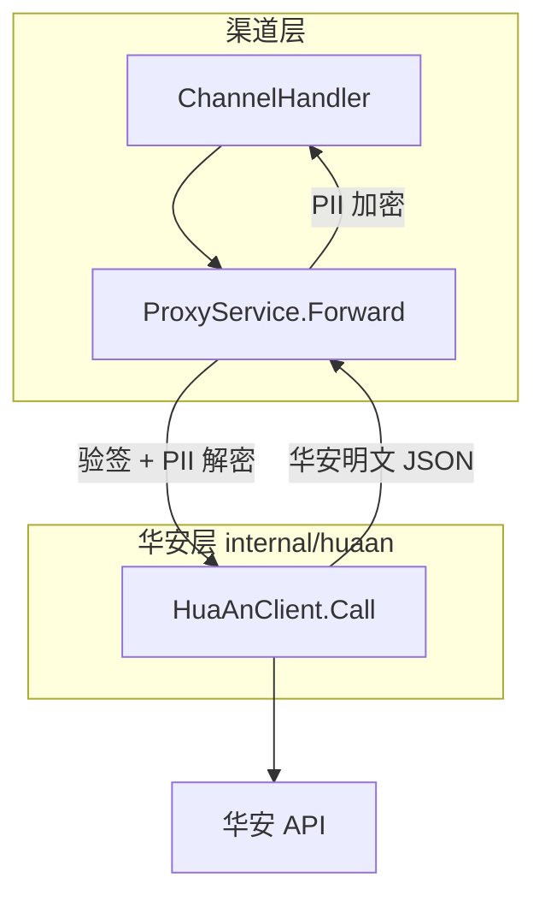
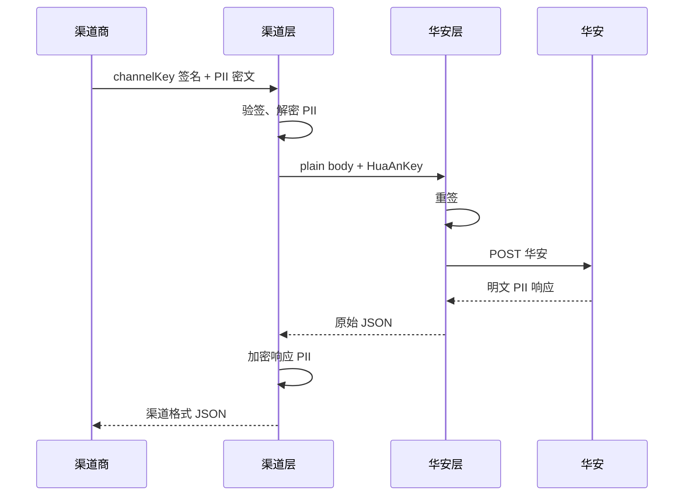

# 系统架构

本文说明 insurance-bridge 的分层设计：渠道侧契约与华安上游契约在代码层面隔离，便于分别测试与演进。

## 1. 角色与职责

本服务是华安与下游渠道商之间的**中间层**：

- **下游渠道商**：调用本服务 `/upChannelApi/*`，使用本服务分配的 `channelKey` 验签，三要素 AES 加密传输。
- **本服务**：验签、PII 转换、密钥替换、转发华安、银行列表缓存。
- **华安上游**：接收本服务转发的请求，使用华安分配的 `huaAnKey` 验签，三要素为明文。

当前阶段以**透明转发**为主；`getBankList` 另有 Redis / 数据库多级缓存。

## 2. 分层架构



### 2.1 渠道层

| 项 | 说明 |
|----|------|
| HTTP 入口 | `POST /upChannelApi/{path}` |
| Handler | `internal/handler/channel.go` → `ProxyService.Forward` |
| 职责 | 校验 `channelCode` / `channelKey` / `sign`；请求 PII 解密、响应 PII 加密；`getBankList` 缓存策略（Redis → DB → 华安） |
| 不包含 | 华安 HTTP 细节、URL 拼接、上游超时处理 |

### 2.2 华安层

| 项 | 说明 |
|----|------|
| 包路径 | `internal/huaan` |
| 核心类型 | `huaan.Client` |
| 职责 | 将 `body.key` 换为 `HuaAnKey`、重算 `sign`、POST 华安、返回**原始 JSON**（PII 明文） |
| 入口方法 | `Client.Call(ctx, apiPath, body, huaAnKey)` |
| 路径常量 | `huaan.APIPaths`（10 个接口，与渠道路由一一对应） |

### 2.3 编排层

`ProxyService`（`internal/service/proxy.go`）负责编排：

```text
Forward:  验签 → [getBankList 缓存] → PII 解密 → huaan.Call → [写缓存] → PII 加密 → 返回
RefreshBankList:  huaan.Call("/getBankList") → 写 Redis / bank_info_t
```

`RefreshBankList` 供管理后台手动刷新银行列表，同样走华安层。

## 3. 接口一一对应

华安文档（`ZF保险.md`）中 `/upChannelApi` 下 10 个 POST 接口，在代码中**只维护一份路径列表**：

```go
// internal/huaan/paths.go
var APIPaths = []string{
    "/proInsurance",
    "/upGradeIns",
    "/getSignUrl",
    "/verifyNoCode",
    "/getPolicyInfoByPhoneNo",
    "/getProductPricesByProductCode",
    "/getBankList",
    "/getProductInfoByChannel",
    "/getProductPricesByPolicyId",
    "/getPolicyInfoByPolicyId",
}
```

- 渠道路由：`ChannelHandler.Register` 遍历 `huaan.APIPaths` 注册。
- 华安调用：`huaan.Client.Call(ctx, path, ...)` 使用相同 path。

## 4. 密钥与 PII 流转



| 字段 | 渠道 → 本服务 | 本服务 → 华安 | 华安 → 本服务 | 本服务 → 渠道 |
|------|---------------|---------------|---------------|---------------|
| `key` | `channelKey` | `huaAnKey` | — | — |
| `sign` | 渠道密钥计算 | 华安密钥重算 | — | — |
| `phoneNo` 等 | AES 密文 | 明文 | 明文 | AES 密文 |

## 5. getBankList 特殊逻辑

`getBankList` 的缓存属于**本服务优化**，归属渠道层编排，不属于华安协议：

| 顺序 | 来源 | 是否请求华安 |
|------|------|--------------|
| 1 | Redis 缓存 | 否 |
| 2 | `bank_info_t` 数据库 | 否 |
| 3 | 华安上游 | 是 |

华安层测试应直接调用 `huaan.Client.Call("/getBankList", ...)`，**不走** Redis / DB 缓存。

管理后台 `POST /admin/api/bank-list/refresh` 通过 `RefreshBankList` 直连华安并更新缓存。

## 6. 代码目录对照

```
cmd/server/main.go          # 组装 ProxyService、huaan.Client
internal/handler/
  channel.go                # 渠道 HTTP 入口
  admin.go                  # 管理后台（含 RefreshBankList）
internal/service/
  proxy.go                  # 渠道编排 + 缓存
  bank_sync.go              # 银行列表解析与落库
internal/huaan/
  paths.go                  # API 路径常量
  client.go                 # 华安 HTTP 客户端
internal/pkg/
  sign/                     # MD5 签名（渠道与华安共用算法）
  cipher/                   # AES-256-GCM
  pii/                      # 三要素加解密（仅渠道层使用）
```

## 7. 依赖注入

```go
// main.go
proxySvc := service.NewProxyService(cfg, log, channelRepo, bankRepo, piiTransformer, bankListCache, nil)
// 最后一个参数 huaanClient 为 nil 时自动创建 huaan.NewClient
```

测试或定制场景可传入自定义 `*huaan.Client`（例如注入带超时的 `http.Client`）。

## 8. 扩展新接口

1. 在 `internal/huaan/paths.go` 的 `APIPaths` 增加路径。
2. `ChannelHandler` 会自动注册新路由（无需改 handler 列表）。
3. 在 `api/openapi.yaml` 与 `README.md` 同步文档。
4. 在 `internal/huaan/client_integration_test.go` 补充华安直连用例。

## 9. 相关文档

- [TESTING.md](./TESTING.md) — 如何分别测试华安层与全流程
- [CHANNEL_INTEGRATION.md](./CHANNEL_INTEGRATION.md) — 渠道侧接入约定
- [DEPLOY.md](./DEPLOY.md) — 部署与配置
