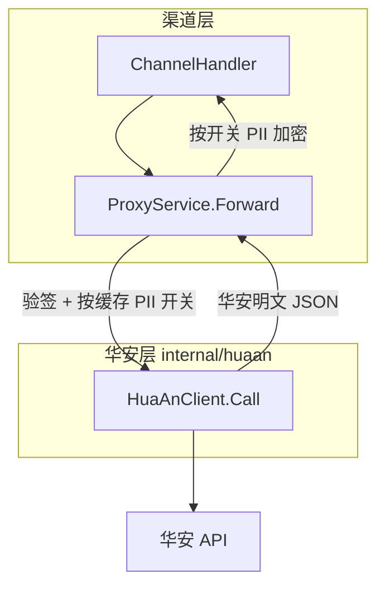
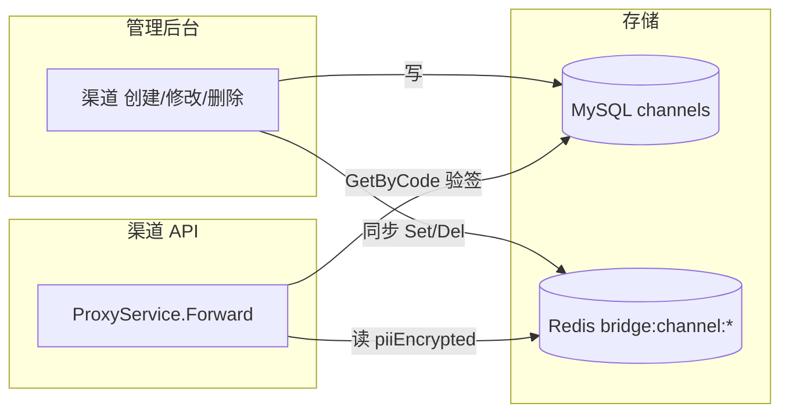
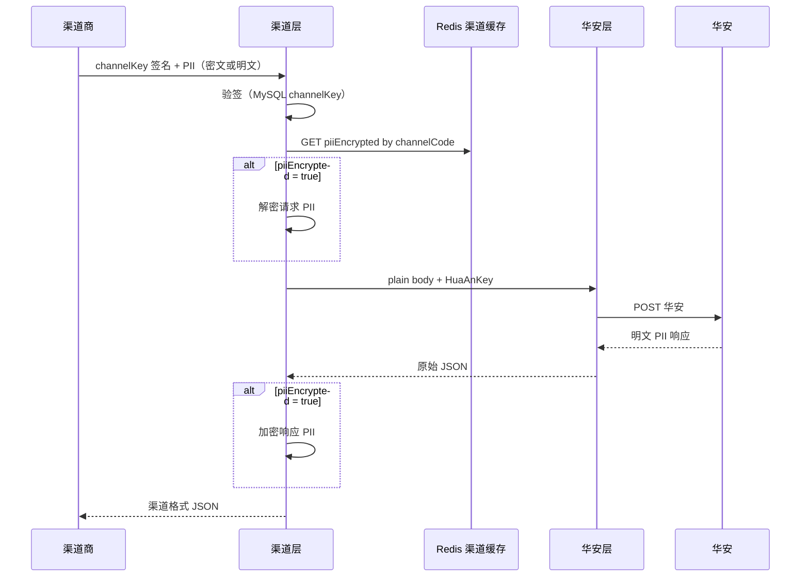

# 系统架构

本文说明 insurance-bridge 的分层设计：渠道侧契约与华安上游契约在代码层面隔离，便于分别测试与演进。

## 1. 角色与职责

本服务是华安与下游渠道商之间的**中间层**：

- **下游渠道商**：调用本服务 `/upChannelApi/*`，使用本服务分配的 `channelKey` 验签；三要素默认 AES 加密传输（可按渠道配置为明文，见 [PII_CHANNEL_ENCRYPTION.md](./PII_CHANNEL_ENCRYPTION.md)）。
- **本服务**：验签、按渠道 PII 开关加解密、密钥替换、转发华安、银行列表缓存；渠道配置（含 PII 开关）缓存在 Redis，管理后台变更时同步更新。
- **华安上游**：接收本服务转发的请求，使用华安分配的 `huaAnKey` 验签，三要素为明文。

当前阶段以**透明转发**为主；`getBankList` 另有 Redis / 数据库多级缓存。**投保结果回调**为华安 → 本服务 → 渠道反向转发（见 [CHANNEL_API.md §7](./CHANNEL_API.md#7-回调通知华安--本服务--渠道)）。

## 2. 分层架构



### 2.1 渠道层

| 项 | 说明 |
|----|------|
| HTTP 入口 | `POST /upChannelApi/{path}` |
| Handler | `internal/handler/channel.go` → `ProxyService.Forward` |
| 职责 | 校验 `channelCode` / `channelKey` / `sign`；从 **Redis 渠道配置缓存** 读取 `piiEncrypted` 决定是否加解密；`getBankList` 缓存策略（Redis → DB → 华安） |
| 不包含 | 华安 HTTP 细节、URL 拼接、上游超时处理 |

### 2.2 华安层

| 项 | 说明 |
|----|------|
| 包路径 | `internal/huaan` |
| 核心类型 | `huaan.Client` |
| 职责 | 始终写入 `huaan.key` 与 `sign`（`sign_enabled=true` 时按规则生成，否则为空字符串）；POST 华安、返回**原始 JSON**（PII 明文） |
| 入口方法 | `Client.Call(ctx, apiPath, body)` |
| 路径常量 | `huaan.APIPaths`（17 个接口，与渠道路由一一对应；部分接口华安上游路径与渠道路径不同，见 `upstreamPathOverrides`） |

### 2.3 编排层

`ProxyService`（`internal/service/proxy.go`）负责编排：

```text
Forward:  验签 → 读渠道缓存(piiEncrypted) → [getBankList 缓存] → [PII 解密] → huaan.Call → [写缓存] → [PII 加密] → 返回
RefreshBankList:  huaan.Call(BankListPath) → 上游 /common/channel/api/getBankList → 写 Redis / bank_info_t
Admin 渠道 CRUD:  写 MySQL → 同步更新/删除 Redis 渠道配置缓存
```

`RefreshBankList` 供管理后台手动刷新银行列表，同样走华安层。

### 2.4 渠道配置缓存

渠道代理除验签外，须按 `channelCode` 判断该渠道是否要求三要素加解密。该配置**不每次查库**，而是缓存在 Redis，由管理后台渠道 CRUD 维护一致性。

| 项 | 说明 |
|----|------|
| 存储 | Redis（与银行列表缓存共用 Redis 实例，键空间独立） |
| 键格式 | `bridge:channel:{channelCode}` |
| 值格式 | JSON，至少含 `piiEncrypted`（bool）；建议同时缓存 `channelKey`、`status` 等代理所需字段，减少重复查库 |
| 读取方 | `ProxyService.Forward`（及 bank list 缓存命中路径）按 `channelCode` 读取 `piiEncrypted` |
| 写入方 | `AdminService` 创建/修改/删除渠道后**同步**更新或删除对应缓存键 |
| 默认值 | **新建渠道** `piiEncrypted = true`（须加密） |
| 冷启动 | 服务启动时从 `channels` 表**预热**全部启用渠道至 Redis；单键未命中时可回源 MySQL 并回填 |
| TTL | 建议**不过期**（`0`），依赖管理操作与启动预热保证一致；避免 TTL 过期后短暂行为不一致 |



**说明**：验签仍可通过 `ChannelRepo.GetByCode` 查 MySQL 获取 `channelKey`（保证密钥权威来源）；`piiEncrypted` **以缓存为准**。若后续将完整渠道配置迁入缓存，可合并为一次 Redis 读取，本方案文档按「PII 开关走缓存」为硬性要求。

## 3. 接口一一对应

华安文档（`ZF保险.md`）中 `/upChannelApi` 下 10 个 POST 接口，以及新增 **获取渠道产品信息**、**短信注册登录**、**查询产品价格** 等（渠道 `/product/info`、`/sms/*`、`/priceByUser` → 华安 `/common/channel/api/*`），在代码中**只维护一份路径列表**：

```go
// internal/huaan/paths.go
var APIPaths = []string{
    ProInsurancePath,             // 上游 /proxy/upChannelApi/proInsurance
    "/getSignUrl",
    "/getProductPricesByProductCode",
    BankListPath,                     // 上游 /common/channel/api/getBankList
    ProductInfoPath,                  // 上游 /common/channel/api/product/info（getProductInfoByChannel 已废弃）
    "/sms/send",                  // 上游 /common/channel/api/sms/send
    "/sms/valid",                 // 上游 /common/channel/api/sms/valid
    "/sms/noValid",               // 上游 /common/channel/api/sms/noValid
    "/priceByUser",               // 上游 /common/channel/api/priceByUser
    "/policy/phone",              // 上游 /common/channel/api/policy/phone
    UserInfoByPhoneNoPath,        // 上游 /common/channel/api/getUserInfoByPhoneNo
    "/getLiabilitiesByProductId", // 上游 /common/channel/api/getLiabilitiesByProductId
    ProductPricesByPolicyIDPath,    // 上游 /common/channel/api/getProductPricesByPolicyId
    PolicyInfoByPolicyIDPath,       // 上游 /common/channel/api/getPolicyInfoByPolicyId
    GetPhoneByTokenPath,            // 上游 /common/channel/api/getPhoneByToken
}
```

- 渠道路由：`ChannelHandler.Register` 遍历 `huaan.APIPaths` 注册。
- 华安调用：`huaan.Client.Call(ctx, path, ...)` 使用渠道路径；若存在 `upstreamPathOverrides` 则转发至对应华安路径。

## 4. 密钥与 PII 流转

是否对三要素加解密由 **`channels.pii_encrypted`** 按渠道配置，运行时经 **Redis 渠道缓存** 读取（键 `bridge:channel:{channelCode}`）。默认 `true`（须加密）。详见 [PII_CHANNEL_ENCRYPTION.md](./PII_CHANNEL_ENCRYPTION.md)。



| 字段 | 渠道 → 本服务 | 本服务 → 华安 | 华安 → 本服务 | 本服务 → 渠道 |
|------|---------------|---------------|---------------|---------------|
| `key` | `channelKey` | `huaan.key`（配置，默认可为空） | — | — |
| `sign` | 渠道密钥计算 | `sign_enabled=true` 时按 `huaan.key` 重签，否则 `""` | — | — |
| `phoneNo` 等 | 默认 AES 密文；`piiEncrypted=false` 时为明文 | 明文 | 明文 | 默认 AES 密文；`piiEncrypted=false` 时为明文 |

## 5. getBankList 特殊逻辑

`getBankList` 的缓存属于**本服务优化**，归属渠道层编排，不属于华安协议：

| 顺序 | 来源 | 是否请求华安 |
|------|------|--------------|
| 1 | Redis 缓存 | 否 |
| 2 | `bank_info_t` 数据库 | 否 |
| 3 | 华安上游 | 是 |

华安层测试应直接调用 `huaan.Client.Call(BankListPath, ...)`（上游 `/common/channel/api/getBankList`），**不走** Redis / DB 缓存。

管理后台 `POST /admin/api/bank-list/refresh` 通过 `RefreshBankList` 直连华安并更新缓存。

## 6. 代码目录对照

```
cmd/server/main.go          # 组装 ProxyService、huaan.Client
internal/handler/
  channel.go                # 渠道 HTTP 入口
  admin.go                  # 管理后台（含 RefreshBankList）
internal/service/
  proxy.go                  # 渠道编排 + 缓存
  bank_sync.go              # 银行列表解析与落库
internal/huaan/
  paths.go                  # API 路径常量
  client.go                 # 华安 HTTP 客户端
internal/pkg/
  sign/                     # MD5 签名（渠道与华安共用算法）
  cipher/                   # AES-256-GCM
  pii/                      # 三要素加解密（仅渠道层使用）
  redis/
    banklist.go             # 银行列表缓存
    channel.go              # 渠道配置缓存（piiEncrypted 等，待实现）
```

## 7. 依赖注入

```go
// main.go
proxySvc := service.NewProxyService(cfg, log, channelRepo, bankRepo, piiTransformer, bankListCache, nil)
// 最后一个参数 huaanClient 为 nil 时自动创建 huaan.NewClient
```

测试或定制场景可传入自定义 `*huaan.Client`（例如注入带超时的 `http.Client`）。

## 8. 扩展新接口

1. 在 `internal/huaan/paths.go` 的 `APIPaths` 增加路径。
2. `ChannelHandler` 会自动注册新路由（无需改 handler 列表）。
3. 在 `api/openapi.yaml` 与 `README.md` 同步文档。
4. 在 `internal/huaan/client_integration_test.go` 补充华安直连用例。

## 9. 相关文档

- [PII_CHANNEL_ENCRYPTION.md](./PII_CHANNEL_ENCRYPTION.md) — 按渠道三要素加解密开关与 Redis 缓存方案
- [TESTING.md](./TESTING.md) — 如何分别测试华安层与全流程
- [CHANNEL_API.md](./CHANNEL_API.md) — 渠道商接口文档（对外）
- [CHANNEL_API_SAMPLES.md](./CHANNEL_API_SAMPLES.md) — 渠道侧请求/响应样例
- [HUAAN_API_SAMPLES.md](./HUAAN_API_SAMPLES.md) — 华安上游原始 JSON 样例
- [DEPLOY.md](./DEPLOY.md) — 部署与配置
