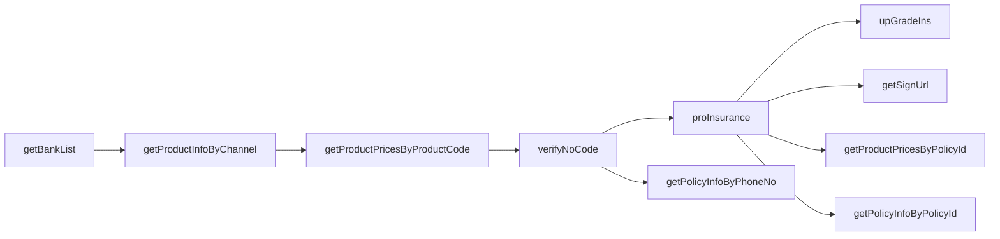

# 渠道商接口文档

本文档描述**下游渠道商**调用 insurance-bridge（保险渠道对接服务）的 HTTP 接口。渠道仅与本服务交互，由本服务完成验签、用户三要素加解密及业务转发。

**版本**：与线上 `upChannelApi` 实现一致（10 个 POST 接口）  
**样例数据**：联调环境实测，见各接口「请求/响应示例」；三要素密文因随机 nonce 每次不同，示例仅展示格式。

---

## 1. 接入准备


| 项                   | 说明                                          |
| ------------------- | ------------------------------------------- |
| 平台域名                | 由运营提供，如 `https://your-bridge.example.com`   |
| `channelCode`       | 渠道编码，管理后台创建渠道后分配                            |
| `channelKey`        | 渠道签名密钥，写入请求体 `key` 字段，参与 `sign` 计算          |
| `dataEncryptionKey` | 32 字节 UTF-8 字符串，与平台约定，用于三要素 AES-256-GCM 加解密 |


接入流程：

1. 联系平台管理员在管理后台创建渠道，获取 `channelCode`、`channelKey`。
2. 索取三要素加密密钥 `dataEncryptionKey`（须为 **32 字节**）。
3. 按本文档实现签名与加解密后，从「查询类」接口开始联调。

---

## 2. 通用约定

### 2.1 请求


| 项      | 值                                               |
| ------ | ----------------------------------------------- |
| 方法     | `POST`                                          |
| URL    | `{平台域名}/upChannelApi/{接口路径}`                    |
| Header | `Content-Type: application/json; charset=utf-8` |
| Body   | JSON 对象                                         |


### 2.2 公共请求字段

除各接口业务字段外，**每个接口**均需携带：


| 字段            | 类型     | 必填  | 说明                            |
| ------------- | ------ | --- | ----------------------------- |
| `timestamp`   | string | 是   | 毫秒时间戳，如 `"1780402912417"`     |
| `channelCode` | string | 是   | 平台分配的渠道编码                     |
| `key`         | string | 是   | 平台分配的 `channelKey`            |
| `sign`        | string | 是   | 按第 3 节规则计算的 MD5 签名，32 位小写十六进制 |


### 2.3 响应


| 项        | 说明                                   |
| -------- | ------------------------------------ |
| HTTP 状态码 | 一般为 `200`（含业务失败、网关错误时也多为 200）        |
| Body     | JSON：`{ "code", "message", "data" }` |


| 字段        | 类型                    | 说明                                  |
| --------- | --------------------- | ----------------------------------- |
| `code`    | integer               | `200` 表示业务成功；其他为失败（含平台网关错误码，见第 5 节） |
| `message` | string                | 提示或错误原因                             |
| `data`    | object / array / null | 业务数据，结构因接口而异                        |


### 2.4 用户三要素（PII）

以下字段在**请求**中须使用 `dataEncryptionKey` 做 **AES-256-GCM** 加密后 **Base64** 编码再提交：


| 字段        | 说明   |
| --------- | ---- |
| `phoneNo` | 手机号  |
| `name`    | 姓名   |
| `idCard`  | 身份证号 |


**加密格式**：

- 算法：AES-256-GCM，密钥 32 字节 UTF-8
- Nonce：随机 12 字节，置于密文前
- 输出：`Base64(nonce || ciphertext+tag)`
- 同一明文每次加密结果不同（nonce 随机），属正常现象

**响应**中，平台对 `data`（及 `data[]` 元素、`insuredList` 项）内的 `phoneNo`、`name`、`idCard`、`insuredCardNo`、`insuredName` 等敏感字段会以相同算法加密后返回。`userId` 等业务 ID 字段一般为**明文**。

参考实现：`internal/pkg/cipher/cipher.go`（Go）。

---

## 3. 签名算法

1. 取请求 JSON 中**除 `sign` 外**的全部参数（含 `key`）。
2. 按参数名 **ASCII 升序**排序。
3. 拼接为 `key1=value1&key2=value2&...`（值为字符串形式；数字按整数输出无小数）。
4. 对拼接字符串做 **MD5**，得到 32 位**小写**十六进制，写入 `sign`。

### 3.1 签名示例

参与签名的参数（`sign` 尚未写入）：

```json
{
  "phoneNo": "13968526776",
  "signSerialNumber": "368dcfac0f534e2ea25ee3763de7b16b",
  "isSignType": "0",
  "key": "c7ae4fc06ca25a73b96fbe2d199e1819",
  "timestamp": "1713236726003"
}
```

拼接串（key 升序）：

```
isSignType=0&key=c7ae4fc06ca25a73b96fbe2d199e1819&phoneNo=13968526776&signSerialNumber=368dcfac0f534e2ea25ee3763de7b16b&timestamp=1713236726003
```

`sign` = `66aa23b057593150546a42d7e51d0b7e`

含三要素密文的接口：签名时使用**密文字符串**参与拼接（与最终提交的 JSON 一致）。

单元测试：`internal/pkg/sign/sign_test.go`。

---

## 4. 接口一览


| 序号  | 接口路径                             | 说明         | 三要素 |
| --- | -------------------------------- | ---------- | --- |
| 1   | `/getBankList`                   | 获取银行列表     | 否   |
| 2   | `/getProductInfoByChannel`       | 查询渠道可售产品   | 否   |
| 3   | `/getProductPricesByProductCode` | 按产品编码查价格   | 是   |
| 4   | `/verifyNoCode`                  | 无验证码实名     | 是   |
| 5   | `/proInsurance`                  | 预投保        | 是   |
| 6   | `/upGradeIns`                    | 保单升级       | 否   |
| 7   | `/getSignUrl`                    | 获取签约链接     | 是   |
| 8   | `/getPolicyInfoByPhoneNo`        | 按手机号查保单    | 是   |
| 9   | `/getProductPricesByPolicyId`    | 按保单 ID 查价格 | 是   |
| 10  | `/getPolicyInfoByPolicyId`       | 按保单 ID 查详情 | 否   |


### 4.1 推荐调用顺序




- `productCode` 来自 `getProductInfoByChannel`。
- `policyId` 由下游在请求体中携带（通常来自其侧 `proInsurance` 结果）；本服务透明转发，不生成、不校验具体值。集成测试从 `proInsurance` 响应取 `policyId` 串联后续用例。
- `userId` 来自 `verifyNoCode` 成功响应（`getSignUrl` 需要）。
- `bankCode`、`payChannelId`、`cardType` 来自 **同一条** `getBankList` 记录（`getSignUrl` 需要；`payChannelId` 与 `bankCode` 配套，禁止跨行组合）。

---

## 5. 错误码

### 5.1 平台网关层

由本服务在校验或转发前返回，`data` 一般为 `null`：


| code | message（示例）                                                    | 说明                |
| ---- | -------------------------------------------------------------- | ----------------- |
| 400  | `invalid json` / `channelCode required` / `pii decrypt failed` | 请求体非法、缺字段或三要素解密失败 |
| 401  | `invalid channel key` / `sign verify failed`                   | 密钥或签名错误           |
| 403  | `invalid channel`                                              | 渠道不存在或已禁用         |
| 502  | `upstream unavailable`                                         | 平台后端业务系统不可达       |
| 504  | `upstream timeout`                                             | 平台处理超时            |


### 5.2 业务层

`code` 非 200 且非上表专用码时，为业务系统返回的失败（如 `500` + `message: "该保单已升级"`）。渠道应以 `code` 与 `message` 为准处理。

---

## 6. 接口说明

以下示例中：

- `channelCode`、`key`、`sign` 为示例值，联调时替换为平台分配凭证。
- 三要素密文记为 `Base64密文(...)`，实际为完整 Base64 字符串。

---

### 6.1 getBankList — 获取银行列表

**路径**：`POST /upChannelApi/getBankList`

#### 请求参数


| 字段   | 必填  | 说明                                     |
| ---- | --- | -------------------------------------- |
| 公共字段 | 是   | `timestamp`、`channelCode`、`key`、`sign` |


#### 请求示例

```json
{
  "timestamp": "1780402912417",
  "channelCode": "YOUR_CHANNEL_CODE",
  "key": "YOUR_CHANNEL_KEY",
  "sign": "3cfb9afd88ff94ced93e1216003f2f3f"
}
```

#### 响应示例

```json
{
  "code": 200,
  "message": "操作成功",
  "data": [
    {
      "bankCode": "BOC",
      "bankName": "中国银行",
      "debitCard": "1",
      "creditCard": "0",
      "payChannelId": "4bf5dd6ece6847e68ee6c5d4345afee4",
      "sortOrder": 1
    },
    {
      "bankCode": "CCB",
      "bankName": "建设银行",
      "debitCard": "1",
      "creditCard": "1",
      "payChannelId": "ef70a5a2afea440d86c9a804d0458736",
      "sortOrder": 2
    }
  ]
}
```

#### 响应字段（data[]）


| 字段             | 类型      | 说明                    |
| -------------- | ------- | --------------------- |
| `bankCode`     | string  | 银行编码                  |
| `bankName`     | string  | 银行名称                  |
| `debitCard`    | string  | `"1"` 支持储蓄卡，`"0"` 不支持 |
| `creditCard`   | string  | `"1"` 支持信用卡，`"0"` 不支持 |
| `sortOrder`    | integer | 排序                    |
| `payChannelId` | string  | 支付渠道 ID               |


---

### 6.2 getProductInfoByChannel — 查询可售产品

**路径**：`POST /upChannelApi/getProductInfoByChannel`

#### 请求参数


| 字段   | 必填  | 说明    |
| ---- | --- | ----- |
| 公共字段 | 是   | 见 2.2 |


#### 请求示例

```json
{
  "timestamp": "1780402912568",
  "channelCode": "YOUR_CHANNEL_CODE",
  "key": "YOUR_CHANNEL_KEY",
  "sign": "421fbad02166ea2479f270c434b08168"
}
```

#### 响应示例

```json
{
  "code": 200,
  "message": "操作成功",
  "data": [
    {
      "productCode": "ZFHLW1041001",
      "productName": "百万医疗险-体验版"
    },
    {
      "productCode": "ZFHLW1040003",
      "productName": "抗癌险-体验版"
    }
  ]
}
```

#### 响应字段（data[]）


| 字段            | 类型     | 说明               |
| ------------- | ------ | ---------------- |
| `productCode` | string | 产品编码，供投保、报价等接口使用 |
| `productName` | string | 产品名称             |


---

### 6.3 getProductPricesByProductCode — 按产品编码查价格

**路径**：`POST /upChannelApi/getProductPricesByProductCode`

`productCode` 须来自 `getProductInfoByChannel` 返回的 `data[].productCode`（与华安配套，勿手写）。华安直连实测见 [HUAAN_API_SAMPLES.md](./HUAAN_API_SAMPLES.md#getproductpricesbyproductcode--查询产品价格)。

#### 请求参数


| 字段                  | 必填  | 说明            |
| ------------------- | --- | ------------- |
| 公共字段                | 是   | 见 2.2         |
| `productCode`       | 是   | 产品编码，来自 getProductInfoByChannel |
| `hasSocialSecurity` | 是   | 是否有社保，如 `"1"` |
| `phoneNo`           | 是   | 三要素密文         |
| `name`              | 是   | 三要素密文         |
| `idCard`            | 是   | 三要素密文         |


#### 请求示例（渠道侧，三要素为密文）

```json
{
  "timestamp": "1780456222050",
  "channelCode": "YOUR_CHANNEL_CODE",
  "key": "YOUR_CHANNEL_KEY",
  "sign": "YOUR_SIGN",
  "productCode": "ZFHLW1041001",
  "hasSocialSecurity": "1",
  "phoneNo": "Base64密文(手机号)",
  "name": "Base64密文(姓名)",
  "idCard": "Base64密文(身份证号)"
}
```

#### 响应示例（华安原文；经本服务返回时 `data` 结构一致）

**productCode = `ZFHLW1041001`（百万医疗险-体验版）**

```json
{
  "code": 200,
  "message": "操作成功",
  "data": [
    {
      "productCode": "ZFHLW1041001",
      "productId": "cc55f8cff47a4f0d88da3a9ca057772a",
      "price": 0.65,
      "productName": "百万医疗险-体验版",
      "productType": "1"
    },
    {
      "productCode": "ZFBWYL1038002",
      "productId": "fade25f092f44d2088fe8d7eeba4d493",
      "price": 150.8,
      "productName": "百万医疗险-正式版",
      "productType": "2"
    }
  ]
}
```

**productCode = `ZFHLW1040003`（抗癌险-体验版）**

```json
{
  "code": 200,
  "message": "操作成功",
  "data": [
    {
      "productCode": "ZFHLW1040003",
      "productId": "3ecd3842febd42e2854403d9cfe67c36",
      "price": 0.70,
      "productName": "抗癌险-体验版",
      "productType": "1"
    },
    {
      "productCode": "ZFHLW1040002",
      "productId": "c19338f72a354ab69307381b9647ec47",
      "price": 42.22,
      "productName": "抗癌险-正式版",
      "productType": "2"
    }
  ]
}
```

#### 响应字段（data[]）


| 字段            | 类型     | 说明    |
| ------------- | ------ | ----- |
| `productCode` | string | 产品编码  |
| `productName` | string | 产品名称  |
| `productId`   | string | 产品 ID |
| `productType` | string | `"1"` 体验版，`"2"` 正式版 |
| `price`       | number | 价格（元） |


---

### 6.4 verifyNoCode — 无验证码实名

**路径**：`POST /upChannelApi/verifyNoCode`

#### 请求参数


| 字段        | 必填  | 说明    |
| --------- | --- | ----- |
| 公共字段      | 是   | 见 2.2 |
| `phoneNo` | 是   | 三要素密文 |
| `name`    | 是   | 三要素密文 |
| `idCard`  | 是   | 三要素密文 |


#### 请求示例

```json
{
  "timestamp": "1780402913290",
  "channelCode": "YOUR_CHANNEL_CODE",
  "key": "YOUR_CHANNEL_KEY",
  "sign": "716cf9e575d8b01a74b1fbe4420aa184",
  "phoneNo": "XydHZbU1oO/vumwo4k8z/UM52n7Lu2Rr+PK7vULscUAiTiAVAi7O",
  "name": "JLaZSs2nUIVfQFu3Tg8+biOwWqd/3d1gT2vD0qU1T6azgg==",
  "idCard": "kDQUVn7kutsIw686y50Pxw2X1JeDsvgO+o8zI/uV3+x+P1DYZ1iP/hkU3VKYjA=="
}
```

#### 响应示例

```json
{
  "code": 200,
  "message": "操作成功",
  "data": {
    "channelCode": "YOUR_CHANNEL_CODE",
    "phoneNo": "xdWkN13Xyf7OqcNUUUxGMO5KlE+caUbbJYfiGzcBovHu17TA0TI2",
    "name": "hElR56I4W/36QJfcMKH6cfxEtp/9QCyWU66tbD6C7uaOsg==",
    "idCard": "QyVxtOL58CCofgvQE1NgL+/W9HnWHxQvRWbDCR+CThWd8qLU8bnbKHkdX9001g==",
    "userId": "5c819c252ab343e2a2a6df98b3a014ab"
  }
}
```

#### 响应字段（data）


| 字段                            | 类型     | 说明                           |
| ----------------------------- | ------ | ---------------------------- |
| `userId`                      | string | 用户 ID（明文），供 `getSignUrl` 等使用 |
| `channelCode`                 | string | 渠道编码                         |
| `phoneNo` / `name` / `idCard` | string | 三要素密文                        |


---

### 6.5 proInsurance — 预投保

**路径**：`POST /upChannelApi/proInsurance`

`productCode` 须来自 `getProductInfoByChannel`。华安直连实测见 [HUAAN_API_SAMPLES.md](./HUAAN_API_SAMPLES.md#proinsurance--投保)。成功时 `policyId` 每次新生成。

#### 请求参数


| 字段                            | 必填  | 说明                       |
| ----------------------------- | --- | ------------------------ |
| 公共字段                          | 是   | 见 2.2                    |
| `productCode`                 | 是   | 产品编码，来自 getProductInfoByChannel |
| `hasSocialSecurity`           | 是   | 是否有社保，如 `"1"`；未传可能导致业务失败 |
| `phoneNo` / `name` / `idCard` | 是   | 三要素密文                    |


#### 请求示例（渠道侧，三要素为密文）

```json
{
  "timestamp": "1780456222458",
  "channelCode": "YOUR_CHANNEL_CODE",
  "key": "YOUR_CHANNEL_KEY",
  "sign": "YOUR_SIGN",
  "productCode": "ZFHLW1041001",
  "hasSocialSecurity": "1",
  "phoneNo": "Base64密文(手机号)",
  "name": "Base64密文(姓名)",
  "idCard": "Base64密文(身份证号)"
}
```

#### 响应示例（成功，华安原文）

**productCode = `ZFHLW1041001`**

```json
{
  "code": 200,
  "message": "操作成功",
  "data": {
    "policyId": "9697d878b6474c619fa43ffa9ca3b4b0",
    "policyStatus": "0",
    "userId": "5c819c252ab343e2a2a6df98b3a014ab"
  }
}
```

**productCode = `ZFHLW1040003`**

```json
{
  "code": 200,
  "message": "操作成功",
  "data": {
    "policyId": "ab185a401820431aad4be32c329ab003",
    "policyStatus": "0",
    "userId": "5c819c252ab343e2a2a6df98b3a014ab"
  }
}
```

#### 响应字段（data）


| 字段             | 类型     | 说明    |
| -------------- | ------ | ----- |
| `policyId`     | string | 保单 ID（每次投保新生成） |
| `policyStatus` | string | 保单状态（实测 `"0"`） |
| `userId`       | string | 用户 ID |


---

### 6.6 upGradeIns — 保单升级

**路径**：`POST /upChannelApi/upGradeIns`

#### 请求参数


| 字段         | 必填  | 说明                         |
| ---------- | --- | -------------------------- |
| 公共字段       | 是   | 见 2.2                      |
| `policyId` | 是   | 保单 ID（通常来自 `proInsurance`） |


#### 请求示例

```json
{
  "timestamp": "1780402913773",
  "channelCode": "YOUR_CHANNEL_CODE",
  "key": "YOUR_CHANNEL_KEY",
  "sign": "65af8684db891de33efc71d5c96abe6b",
  "policyId": "91a51cc70e724d4885ac2e27530099ec"
}
```

#### 响应示例（业务失败）

```json
{
  "code": 500,
  "message": "该保单已升级",
  "data": null
}
```

---

### 6.7 getSignUrl — 获取签约链接

**路径**：`POST /upChannelApi/getSignUrl`

#### 请求参数


| 字段                            | 必填  | 说明                              |
| ----------------------------- | --- | ------------------------------- |
| 公共字段                          | 是   | 见 2.2                           |
| `policyId`                    | 是   | 保单 ID                           |
| `bankCode`                    | 是   | 银行编码，须与下方 `payChannelId` 来自同一条 `getBankList` 记录 |
| `payChannelId`                | 是   | 支付渠道 ID，与 `bankCode` 配套，取自 `getBankList` 同条 `data[]` |
| `cardType`                    | 是   | 卡类型，`"1"` 储蓄卡，`"2"` 信用卡（与所选银行 `debitCard`/`creditCard` 能力一致） |
| `userId`                      | 是   | 用户 ID（**明文**，来自 `verifyNoCode`） |
| `phoneNo` / `name` / `idCard` | 是   | 三要素密文                           |


#### 请求示例

```json
{
  "timestamp": "1780402913925",
  "channelCode": "YOUR_CHANNEL_CODE",
  "key": "YOUR_CHANNEL_KEY",
  "sign": "9468fc415cbaee2f09defc9e5c953b8e",
  "policyId": "91a51cc70e724d4885ac2e27530099ec",
  "bankCode": "BOC",
  "payChannelId": "4bf5dd6ece6847e68ee6c5d4345afee4",
  "cardType": "1",
  "userId": "5c819c252ab343e2a2a6df98b3a014ab",
  "phoneNo": "lzs41ZKWPBHagnOgJg8JpxAakG7q+ppmIAIoOy0CgkZ39qPaiPcP",
  "name": "SWL53fWyAiPtRyM5nXjaVWuQ5HcvVfVWNl94k/O64oAkrQ==",
  "idCard": "RvTtjRtlctzHQURxaQ0reiaf54wTmknIXg7Qz20Szj6P+x8qFoR/Jq2BuYPrDA=="
}
```

#### 响应示例（业务失败）

```json
{
  "code": 500,
  "message": "支付通道不存在",
  "data": null
}
```

成功时 `data` 为签约链接等业务字段，以实测为准。

---

### 6.8 getPolicyInfoByPhoneNo — 按手机号查保单

**路径**：`POST /upChannelApi/getPolicyInfoByPhoneNo`

#### 请求参数


| 字段                            | 必填  | 说明    |
| ----------------------------- | --- | ----- |
| 公共字段                          | 是   | 见 2.2 |
| `phoneNo` / `name` / `idCard` | 是   | 三要素密文 |


#### 请求示例

```json
{
  "timestamp": "1780402914170",
  "channelCode": "YOUR_CHANNEL_CODE",
  "key": "YOUR_CHANNEL_KEY",
  "sign": "03f768089b135544bd5f341a90c354af",
  "phoneNo": "+iKkdX8U8+Um/Q6AvEXA5fJBcxCfwOsJ4zSLWtZHS0vqd7d++oS/",
  "name": "RzoMJ97ydOrDF4LqxSa2KOu1RII7YVjPGVrcvSyR2MKyAQ==",
  "idCard": "WK97dLPdmFNofo8Szz8hkweO53SkhqwIgw9fR2FTt6ltnlWYOk2rXRHMRTXFDQ=="
}
```

#### 响应示例

```json
{
  "code": 200,
  "message": "操作成功",
  "data": [
    {
      "productCode": "ZFHLW1041001",
      "productName": "百万医疗险-体验版",
      "productId": "cc55f8cff47a4f0d88da3a9ca057772a",
      "isPolicy": "0",
      "policyNo": "",
      "policyStatus": "",
      "payPremium": "",
      "insuredList": [],
      "riskList": []
    },
    {
      "productCode": "ZFHLW1040003",
      "productName": "抗癌险-体验版",
      "productId": "3ecd3842febd42e2854403d9cfe67c36",
      "isPolicy": "0",
      "policyNo": "",
      "policyStatus": "",
      "payPremium": "",
      "insuredList": [],
      "riskList": []
    }
  ]
}
```

---

### 6.9 getProductPricesByPolicyId — 按保单 ID 查价格

**路径**：`POST /upChannelApi/getProductPricesByPolicyId`

#### 请求参数


| 字段                            | 必填  | 说明      |
| ----------------------------- | --- | ------- |
| 公共字段                          | 是   | 见 2.2   |
| `policyId`                    | 是   | 保单 ID   |
| `hasSocialSecurity`           | 是   | 如 `"1"` |
| `phoneNo` / `name` / `idCard` | 是   | 三要素密文   |


#### 请求示例

```json
{
  "timestamp": "1780402914473",
  "channelCode": "YOUR_CHANNEL_CODE",
  "key": "YOUR_CHANNEL_KEY",
  "sign": "727d07f6b663858ae5eef8b1c498e3ed",
  "policyId": "91a51cc70e724d4885ac2e27530099ec",
  "hasSocialSecurity": "1",
  "phoneNo": "H5g26NxNMf4+qwEYr76GhplYPYa959QkdBQhlcXc9aS7o110EGDT",
  "name": "1PqW/yD+NDvDdF5X1e/xOqxl0UR8JDxdXPVRuuaz1XxSSA==",
  "idCard": "gEjysIWwejvSdeL5EF2uRpFGhdyGVgoIYrXKmLmNgaviN6hcAw4M5RqY2vpYMg=="
}
```

#### 响应示例

```json
{
  "code": 200,
  "message": "操作成功",
  "data": {
    "price": 0.7
  }
}
```

---

### 6.10 getPolicyInfoByPolicyId — 按保单 ID 查详情

**路径**：`POST /upChannelApi/getPolicyInfoByPolicyId`

#### 请求参数


| 字段         | 必填  | 说明    |
| ---------- | --- | ----- |
| 公共字段       | 是   | 见 2.2 |
| `policyId` | 是   | 保单 ID |


#### 请求示例

```json
{
  "timestamp": "1780402914689",
  "channelCode": "YOUR_CHANNEL_CODE",
  "key": "YOUR_CHANNEL_KEY",
  "sign": "0c23ea297f58cfa8f7df652413337d00",
  "policyId": "91a51cc70e724d4885ac2e27530099ec"
}
```

#### 响应示例

```json
{
  "code": 200,
  "message": "操作成功",
  "data": {
    "policyId": "91a51cc70e724d4885ac2e27530099ec",
    "policyStatus": "0",
    "productCode": "ZFHLW1040003",
    "productName": "抗癌险-体验版",
    "productId": "3ecd3842febd42e2854403d9cfe67c36",
    "payPremium": 0.7,
    "hasSocialSecurity": "1",
    "createTime": "2026-06-02",
    "phoneNo": "nMD5y0Zt+l689rrTosABnmXrDka4xvUHua1V5q6ityJ0SieqdCvB",
    "name": "4kY1YXXrVNF1fMoXDkYnZRKEbFFcn4c3OjPicn6JvZyM6w==",
    "idCard": "7eRnHOJF6EhXoHh9bnThQWt6E6Mqb/Mq3LeKdU/o/3kaeX1tJansbLWiV7Xq9A==",
    "insuredList": [
      {
        "phoneNo": "YGBlN5YY6Ho8wCV8YbsoEwiaFLh1aI8NkO8PoHcaDUguYlorNjbt",
        "insuredName": "SWqoxc0y8oEKpO+EtMB1NwFToBd/6IJGazCZ90GEGRwhAw==",
        "insuredCardNo": "T8XMwdR24kHea8SjSsF0o4AMeDuRIgtagwlXwITUEVQ+MRr7xe6oS9OaLKAl4Q==",
        "hasSocialSecurity": "1"
      }
    ],
    "riskList": [
      { "riskCode": null, "riskName": "恶性肿瘤医疗保险金" },
      { "riskCode": "1040102", "riskName": "罕见特定恶性肿瘤——重度疾病保险金" }
    ],
    "optionalRiskList": [],
    "autoRenew": null,
    "policyStartDate": null,
    "policyEndDate": null
  }
}
```

---

## 7. 联调与工具


| 资源                                                 | 说明                                        |
| -------------------------------------------------- | ----------------------------------------- |
| [CHANNEL_API_SAMPLES.md](./CHANNEL_API_SAMPLES.md) | 完整请求/响应 JSON 归档（内部联调）                     |
| `scripts/channel_sim/`                             | 依次调用 10 个接口的模拟程序                          |
| OpenAPI                                            | 运行服务后访问 `{平台域名}/openapi.yaml`（管理后台接口亦在其中） |


环境变量示例（模拟程序）：

```bash
export BRIDGE_BASE_URL="https://your-bridge.example.com"
export CHANNEL_CODE="YOUR_CHANNEL_CODE"
export CHANNEL_KEY="YOUR_CHANNEL_KEY"
export DATA_ENCRYPTION_KEY="32字节密钥..."
export TEST_PHONE="..." TEST_NAME="..." TEST_ID_CARD="..."
go run ./scripts/channel_sim/
```

---

## 8. 修订记录


| 日期         | 说明                |
| ---------- | ----------------- |
| 2026-06-02 | 初版：基于渠道侧实测请求/响应编写 |


