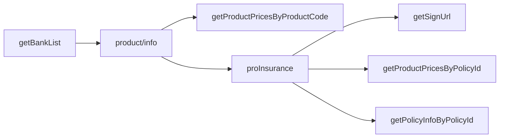

# 渠道商接口文档

本文档描述**下游渠道商**调用 insurance-bridge（保险渠道对接服务）的 HTTP 接口。渠道仅与本服务交互，由本服务完成验签、用户三要素加解密及业务转发。

**版本**：与线上 `upChannelApi` 实现一致（17 个 POST 接口）  
**样例数据**：联调环境实测，见各接口「请求/响应示例」；三要素密文因随机 nonce 每次不同，示例仅展示格式。

---

## 1. 接入准备


| 项                   | 说明                                          |
| ------------------- | ------------------------------------------- |
| 平台域名                | 由运营提供，如 `https://your-bridge.example.com`   |
| `channelCode`       | 渠道编码，管理后台创建渠道后分配                            |
| `channelKey`        | 渠道签名密钥，写入请求体 `key` 字段，参与 `sign` 计算          |
| `dataEncryptionKey` | 32 字节 UTF-8 字符串，与平台约定，用于三要素 AES-256-GCM 加解密（仅 `piiEncrypted=true` 时需要） |
| `piiEncrypted`      | 由平台按渠道配置，**渠道侧不可传**；决定本渠道是否须对三要素加解密。平台在 Redis 缓存该配置，管理后台变更渠道时同步更新；API 按 `channelCode` 读取 |


接入流程：

1. 联系平台管理员在管理后台创建渠道，获取 `channelCode`、`channelKey`（**默认 `piiEncrypted=true`，须加密三要素**）。
2. 向运营确认该渠道的 `piiEncrypted`：为 `true` 时索取 `dataEncryptionKey`（须为 **32 字节**）；为 `false` 时三要素可明文传输（须平台显式关闭加密）。
3. 按本文档实现签名与（按需）加解密后，从「查询类」接口开始联调。

---

## 2. 通用约定

### 2.1 请求


| 项      | 值                                               |
| ------ | ----------------------------------------------- |
| 方法     | `POST`                                          |
| URL    | `{平台域名}/upChannelApi/{接口路径}`                    |
| Header | `Content-Type: application/json; charset=utf-8` |
| Body   | JSON 对象                                         |


### 2.2 公共请求字段

除各接口业务字段外，**每个接口**均需携带：


| 字段            | 类型     | 必填  | 说明                            |
| ------------- | ------ | --- | ----------------------------- |
| `timestamp`   | string | 是   | 毫秒时间戳，如 `"1780402912417"`     |
| `channelCode` | string | 是   | 平台分配的渠道编码                     |
| `key`         | string | 是   | 平台分配的 `channelKey`            |
| `sign`        | string | 是   | 按第 3 节规则计算的 MD5 签名，32 位小写十六进制 |


### 2.3 响应


| 项        | 说明                                   |
| -------- | ------------------------------------ |
| HTTP 状态码 | 一般为 `200`（含业务失败、网关错误时也多为 200）        |
| Body     | JSON：`{ "code", "message", "data" }` |


| 字段        | 类型                    | 说明                                  |
| --------- | --------------------- | ----------------------------------- |
| `code`    | integer               | `200` 表示业务成功；其他为失败（含平台网关错误码，见第 5 节） |
| `message` | string                | 提示或错误原因                             |
| `data`    | object / array / null | 业务数据，结构因接口而异                        |


### 2.4 用户三要素（PII）

是否对三要素加解密由平台按渠道配置字段 **`piiEncrypted`** 决定（管理后台维护，运行时缓存在 Redis，渠道 API 按 `channelCode` 查询）。**新建渠道默认为 `true`（须加密）**。渠道商接入前须向运营确认所属渠道的配置。

#### 2.4.1 `piiEncrypted = true`（默认）

以下字段在**请求**中须使用 `dataEncryptionKey` 做 **AES-256-GCM** 加密后 **Base64** 编码再提交：


| 字段        | 说明   |
| --------- | ---- |
| `phoneNo` | 手机号  |
| `name`    | 姓名   |
| `idCard`  | 身份证号 |


**加密格式**：

- 算法：AES-256-GCM，密钥 32 字节 UTF-8
- Nonce：随机 12 字节，置于密文前
- 输出：`Base64(nonce || ciphertext+tag)`
- 同一明文每次加密结果不同（nonce 随机），属正常现象

**响应**中，平台对 `data`（及 `data[]` 元素、`insuredList` 项）内的 `phoneNo`、`name`、`idCard`、`insuredCardNo`、`insuredName` 等敏感字段会以相同算法加密后返回。`userId` 等业务 ID 字段一般为**明文**。

#### 2.4.2 `piiEncrypted = false`

- **请求**：`phoneNo`、`name`、`idCard` 及 `insuredList` 内相关字段以**明文**提交。
- **响应**：上述 PII 字段以**明文**返回（与华安字段一致）。
- **签名**：仍对 JSON 中**实际提交的明文**参与 `sign` 计算。
- **适用**：须平台在管理后台显式关闭；通常仅测试联调或可信内网渠道。

参考实现：`internal/pkg/cipher/cipher.go`（Go）。架构说明见 [PII_CHANNEL_ENCRYPTION.md](./PII_CHANNEL_ENCRYPTION.md)、[ARCHITECTURE.md](./ARCHITECTURE.md)。

---

## 3. 签名算法

1. 取请求 JSON 中**除 `sign` 外**的全部参数（含 `key`）。
2. 按参数名 **ASCII 升序**排序。
3. 拼接为 `key1=value1&key2=value2&...`（值为字符串形式；数字按整数输出无小数）。
4. 对拼接字符串做 **MD5**，得到 32 位**小写**十六进制，写入 `sign`。

### 3.1 签名示例

参与签名的参数（`sign` 尚未写入）：

```json
{
  "phoneNo": "13968526776",
  "signSerialNumber": "368dcfac0f534e2ea25ee3763de7b16b",
  "isSignType": "0",
  "key": "c7ae4fc06ca25a73b96fbe2d199e1819",
  "timestamp": "1713236726003"
}
```

拼接串（key 升序）：

```
isSignType=0&key=c7ae4fc06ca25a73b96fbe2d199e1819&phoneNo=13968526776&signSerialNumber=368dcfac0f534e2ea25ee3763de7b16b&timestamp=1713236726003
```

`sign` = `66aa23b057593150546a42d7e51d0b7e`

含三要素密文的接口：签名时使用**密文字符串**参与拼接（与最终提交的 JSON 一致）。

单元测试：`internal/pkg/sign/sign_test.go`。

---

## 4. 接口一览


| 序号  | 接口路径                             | 说明         | 三要素 |
| --- | -------------------------------- | ---------- | --- |
| 1   | `/getBankList`                   | 获取银行列表     | 否   |
| 2   | ~~`/getProductInfoByChannel`~~   | ~~查询渠道可售产品~~ **（已废弃，请用 `/product/info`）** | —   |
| 3   | `/product/info`                  | 获取渠道产品信息（含 productCode） | 是   |
| 4   | `/sms/send`                      | 获取用户短信验证码  | 是   |
| 5   | `/sms/valid`                     | 短信验证码校验    | 是   |
| 6   | `/sms/noValid`                   | 免短信验证码注册登录 | 是   |
| 7   | `/priceByUser`                   | 查询产品价格     | 是   |
| 8   | `/policy/phone`                  | 查询用户投保情况   | 是   |
| 9   | `/getUserInfoByPhoneNo`          | 查询用户信息     | 是（phoneNo 或 userId） |
| 10  | `/getLiabilitiesByProductId`     | 查询可选责任列表   | 是   |
| 11  | `/getProductPricesByProductCode` | 按产品编码查价格   | 是   |
| 12  | ~~`/verifyNoCode`~~              | ~~无验证码实名~~ **（已废弃）** | —   |
| 13  | `/proInsurance`                  | 预投保        | 是   |
| 14  | ~~`/upGradeIns`~~                | ~~保单升级~~ **（已废弃）** | —   |
| 15  | `/getSignUrl`                    | 获取签约链接     | 是   |
| 16  | ~~`/getPolicyInfoByPhoneNo`~~    | ~~按手机号查保单~~ **（已废弃）** | —   |
| 17  | `/getProductPricesByPolicyId`    | 按保单 ID 查价格（收银台） | 否   |
| 18  | `/getPolicyInfoByPolicyId`       | 按保单 ID 查详情 | 否   |
| 19  | `/getPhoneByToken`               | 一键登录解密手机号 | 否（响应 data 为手机号须加密） |


### 4.1 推荐调用顺序




- `productCode` 来自 `product/info`（`getProductInfoByChannel` 已废弃）。
- `policyId` 由下游在请求体中携带（通常来自其侧 `proInsurance` 结果）；本服务透明转发，不生成、不校验具体值。集成测试从 `proInsurance` 响应取 `policyId` 串联后续用例。
- `userId` 来自 `proInsurance` 成功响应（`getSignUrl` 需要）。
- `bankCode`、`payChannelId`、`cardType` 来自 **同一条** `getBankList` 记录（`getSignUrl` 需要；`payChannelId` 与 `bankCode` 配套，禁止跨行组合）。

---

## 5. 错误码

### 5.1 平台网关层

由本服务在校验或转发前返回，`data` 一般为 `null`：


| code | message（示例）                                                    | 说明                |
| ---- | -------------------------------------------------------------- | ----------------- |
| 400  | `invalid json` / `channelCode required` / `pii decrypt failed` | 请求体非法、缺字段或三要素解密失败 |
| 401  | `invalid channel key` / `sign verify failed`                   | 密钥或签名错误           |
| 403  | `invalid channel`                                              | 渠道不存在或已禁用         |
| 502  | `upstream unavailable`                                         | 平台后端业务系统不可达       |
| 504  | `upstream timeout`                                             | 平台处理超时            |


### 5.2 业务层

`code` 非 200 且非上表专用码时，为业务系统返回的失败（如 `500` + `message: "该保单已升级"`）。渠道应以 `code` 与 `message` 为准处理。

---

## 6. 接口说明

以下示例中：

- `channelCode`、`key`、`sign` 为示例值，联调时替换为平台分配凭证。
- 三要素密文记为 `Base64密文(...)`，实际为完整 Base64 字符串。

---

### 6.1 getBankList — 获取支持的银行列表

**路径**：`POST /upChannelApi/getBankList`（本服务转发华安 `POST /common/channel/api/getBankList`）

#### 请求参数


| 字段   | 必填  | 说明                                     |
| ---- | --- | -------------------------------------- |
| 公共字段 | 是   | `timestamp`、`channelCode`、`key`、`sign`（华安侧仅需 `channelCode` 等业务字段，本服务转发时补齐 timestamp/key/sign） |


#### 请求示例

```json
{
  "timestamp": "1780402912417",
  "channelCode": "YOUR_CHANNEL_CODE",
  "key": "YOUR_CHANNEL_KEY",
  "sign": "3cfb9afd88ff94ced93e1216003f2f3f"
}
```

#### 响应示例

```json
{
  "code": 200,
  "message": "成功",
  "data": [
    {
      "bankName": "中国工商银行",
      "bankCode": "ICBC",
      "debitCard": "1",
      "creditCard": "1",
      "payChannelId": "xxx",
      "isActBank": 1
    }
  ]
}
```

#### 响应字段（data[]）


| 字段             | 类型      | 说明                    |
| -------------- | ------- | --------------------- |
| `bankName`     | string  | 银行名称                  |
| `bankCode`     | string  | 银行编码                  |
| `debitCard`    | string  | `"1"` 支持储蓄卡，`"0"` 不支持 |
| `creditCard`   | string  | `"1"` 支持信用卡，`"0"` 不支持 |
| `payChannelId` | string  | 支付渠道 ID（与 `bankCode` 配套，供 getSignUrl 使用） |
| `isActBank`    | integer | `1` 活跃银行，`0` 非活跃      |


历史华安响应可能仍含 `sortOrder` 等字段，本服务**原样转发**（Redis/直连华安）；从 `bank_info_t` 重建时保留上述规范字段。


---

### 6.2 getProductInfoByChannel — 查询可售产品（已废弃）

> **已废弃**：华安侧不再使用该接口；请改用 **6.x product/info**（`/upChannelApi/product/info`）获取 `productCode`。本服务已从 `APIPaths` 移除，不再转发。

**路径**：~~`POST /upChannelApi/getProductInfoByChannel`~~

#### 请求参数


| 字段   | 必填  | 说明    |
| ---- | --- | ----- |
| 公共字段 | 是   | 见 2.2 |


#### 请求示例

```json
{
  "timestamp": "1780402912568",
  "channelCode": "YOUR_CHANNEL_CODE",
  "key": "YOUR_CHANNEL_KEY",
  "sign": "421fbad02166ea2479f270c434b08168"
}
```

#### 响应示例

```json
{
  "code": 200,
  "message": "操作成功",
  "data": [
    {
      "productCode": "ZFHLW1041001",
      "productName": "百万医疗险-体验版"
    },
    {
      "productCode": "ZFHLW1040003",
      "productName": "抗癌险-体验版"
    }
  ]
}
```

#### 响应字段（data[]）


| 字段            | 类型     | 说明               |
| ------------- | ------ | ---------------- |
| `productCode` | string | 产品编码，供投保、报价等接口使用 |
| `productName` | string | 产品名称             |


---

### 6.3 product/info — 获取渠道产品信息

**路径**：`POST /upChannelApi/product/info`（本服务转发华安 `POST /common/channel/api/product/info`）

按手机号查询当前渠道下的产品详情（产品编码、名称、保司、版本类型等）。

#### 请求参数


| 字段      | 必填  | 说明            |
| ------- | --- | ------------- |
| 公共字段    | 是   | 见 2.2         |
| `phoneNo` | 是   | 手机号，三要素须加密/明文与渠道 `piiEncrypted` 一致 |


#### 请求示例

```json
{
  "timestamp": "1780402912568",
  "channelCode": "YOUR_CHANNEL_CODE",
  "key": "YOUR_CHANNEL_KEY",
  "phoneNo": "AES-GCM-Base64-密文或明文",
  "sign": "421fbad02166ea2479f270c434b08168"
}
```

#### 响应示例

```json
{
  "code": 200,
  "msg": "请求成功",
  "data": {
    "productCode": "PRO2026001",
    "productName": "月度体验版意外险",
    "companyName": "XX人寿保险",
    "productType": 1,
    "channelCode": "hy333"
  }
}
```

`productType`：`1` 基础版，`2` 升级版。

#### 响应字段（data）


| 字段            | 类型      | 说明     |
| ------------- | ------- | ------ |
| `productCode` | string  | 产品编码   |
| `productName` | string  | 产品名称   |
| `companyName` | string  | 保险公司名称 |
| `productType` | integer | 1 基础版，2 升级版 |
| `channelCode` | string  | 渠道编码   |


---

### 6.4 sms/send — 获取用户短信验证码

**路径**：`POST /upChannelApi/sms/send`（本服务转发华安 `POST /common/channel/api/sms/send`）

向指定手机号发送短信验证码。

#### 请求参数


| 字段      | 必填  | 说明            |
| ------- | --- | ------------- |
| 公共字段    | 是   | 见 2.2         |
| `phoneNo` | 是   | 手机号，三要素须加密/明文与渠道 `piiEncrypted` 一致 |


#### 请求示例

```json
{
  "timestamp": "1780402912568",
  "channelCode": "YOUR_CHANNEL_CODE",
  "key": "YOUR_CHANNEL_KEY",
  "phoneNo": "AES-GCM-Base64-密文或明文",
  "sign": "421fbad02166ea2479f270c434b08168"
}
```

#### 响应示例

```json
{
  "code": 200,
  "data": "验证码发送成功",
  "message": "操作成功"
}
```

#### 响应字段


| 字段        | 类型     | 说明                          |
| --------- | ------ | --------------------------- |
| `code`    | integer | `200` 表示成功                  |
| `message` | string | 提示信息                        |
| `data`    | string | 发送结果描述，如 `"验证码发送成功"` |


---

### 6.5 sms/valid — 短信验证码校验

**路径**：`POST /upChannelApi/sms/valid`（本服务转发华安 `POST /common/channel/api/sms/valid`）

校验手机号与短信验证码，成功时返回用户信息。

#### 请求参数


| 字段        | 必填  | 说明            |
| --------- | --- | ------------- |
| 公共字段      | 是   | 见 2.2         |
| `phoneNo` | 是   | 手机号，须加密/明文与渠道 `piiEncrypted` 一致（华安上游字段名为 `phoneNo`） |
| `code`    | 是   | 短信验证码，明文（华安上游字段名为 `code`，非 `smsCode`） |


#### 请求示例

```json
{
  "timestamp": "1780402912568",
  "channelCode": "YOUR_CHANNEL_CODE",
  "key": "YOUR_CHANNEL_KEY",
  "phoneNo": "AES-GCM-Base64-密文或明文",
  "code": "1234",
  "sign": "421fbad02166ea2479f270c434b08168"
}
```

> **兼容说明**：本服务转发华安前会将旧字段 `mobile` → `phoneNo`、`smsCode` → `code` 自动映射；新接入请直接使用 `phoneNo` 与 `code`。

#### 华安上游签名（本服务 → 华安，`sign_enabled=true`）

`sign` 写入 HTTP 请求头（body 不含 `key`/`sign`）。参与签名的 body 字段：

- `channelCode`、`phoneNo`、`code`、`timestamp`
- 明文末尾标准拼接 `&key={华安渠道密钥}`，MD5 后 32 位大写

示例（`phoneNo=***`，`code=3875`）：

```text
channelCode=BLtJjF&code=3875&phoneNo=***&timestamp=1782703244953&key=fb9ec7236b6c45b7bfd562672e0373ea
→ sign=F13AC45360ED163467F3D48FD11A33BE
```

#### 响应示例

```json
{
  "code": 200,
  "message": "请求成功",
  "data": {
    "userId": "xxx",
    "idCard": "xxx",
    "name": "xxx",
    "phoneNo": "xxx",
    "channelCode": "xxx"
  }
}
```

#### 响应字段（data）


| 字段            | 类型     | 说明                    |
| ------------- | ------ | --------------------- |
| `userId`      | string | 用户 ID                 |
| `idCard`      | string | 身份证号（返回渠道时加密）        |
| `name`        | string | 姓名（返回渠道时加密）           |
| `phoneNo`     | string | 手机号（返回渠道时加密）          |
| `channelCode` | string | 渠道编码                  |


---

### 6.6 sms/noValid — 免短信验证码注册登录

**路径**：`POST /upChannelApi/sms/noValid`（本服务转发华安 `POST /common/channel/api/sms/noValid`）

仅凭手机号完成注册或登录，无需短信验证码。

#### 请求参数


| 字段       | 必填  | 说明            |
| -------- | --- | ------------- |
| 公共字段     | 是   | 见 2.2         |
| `mobile` | 是   | 手机号，须加密/明文与渠道 `piiEncrypted` 一致 |


#### 请求示例

```json
{
  "timestamp": "1780402912568",
  "channelCode": "YOUR_CHANNEL_CODE",
  "key": "YOUR_CHANNEL_KEY",
  "mobile": "AES-GCM-Base64-密文或明文",
  "sign": "421fbad02166ea2479f270c434b08168"
}
```

#### 响应示例

```json
{
  "code": 200,
  "message": "请求成功",
  "data": {
    "userId": "xxx",
    "idCard": "xxx",
    "name": "xxx",
    "phoneNo": "xxx",
    "channelCode": "xxx"
  }
}
```

#### 响应字段（data）

与 [6.5 sms/valid](#65-smsvalid--短信验证码校验) 相同：`userId`、`idCard`、`name`、`phoneNo`、`channelCode`；三要素返回渠道时加密。

---

### 6.7 priceByUser — 查询产品价格

**路径**：`POST /upChannelApi/priceByUser`（本服务转发华安 `POST /common/channel/api/priceByUser`）

按产品编码与用户身份证号查询产品价格（含单次月缴、年保费规模及生效天数等）。

#### 请求参数


| 字段                  | 必填  | 说明                              |
| ------------------- | --- | ------------------------------- |
| 公共字段                | 是   | 见 2.2                           |
| `productCode`       | 是   | 产品编码                            |
| `idCard`            | 是   | 身份证号，须加密/明文与渠道 `piiEncrypted` 一致 |
| `hasSocialSecurity` | 是   | 是否有社保：`1` 有，`0` 无（整数）           |
| `productPriceList`  | 否   | 责任项与份数列表；不传则使用华安后台默认配置           |


`productPriceList[]` 元素字段：

| 字段              | 类型      | 说明     |
| --------------- | ------- | ------ |
| `liabilityName` | string  | 责任名称   |
| `price`         | number  | 单价     |
| `kindCode`      | string  | 险种代码   |
| `uwCount`       | integer | 投保份数   |

#### 请求示例

```json
{
  "timestamp": "1780402912568",
  "channelCode": "YOUR_CHANNEL_CODE",
  "key": "YOUR_CHANNEL_KEY",
  "productCode": "PROD2025001",
  "idCard": "AES-GCM-Base64-密文或明文",
  "hasSocialSecurity": 1,
  "productPriceList": [
    {
      "liabilityName": "罕见保险金",
      "price": 0.0,
      "kindCode": "102",
      "uwCount": 20
    }
  ],
  "sign": "421fbad02166ea2479f270c434b08168"
}
```

#### 响应示例

```json
{
  "code": 200,
  "message": "成功",
  "data": {
    "productId": "PID2025001",
    "productName": "综合意外险",
    "productCode": "PROD2025001",
    "productType": "意外险",
    "price": 95.0,
    "yearPremium": 2000,
    "expEffectAfterDays": 1,
    "formalEffectAfterDays": 1
  }
}
```

#### 响应字段（data）


| 字段                    | 类型      | 说明           |
| --------------------- | ------- | ------------ |
| `productId`           | string  | 产品 ID        |
| `productName`         | string  | 产品名称         |
| `productCode`         | string  | 产品编码         |
| `productType`         | string  | 产品类型         |
| `price`               | number  | 单次价格（每月缴纳保费） |
| `yearPremium`         | number  | 年保费规模        |
| `expEffectAfterDays`  | integer | 体验版生效天数      |
| `formalEffectAfterDays` | integer | 正式版生效天数    |


---

### 6.8 policy/phone — 通过手机号查询用户投保情况

**路径**：`POST /upChannelApi/policy/phone`（本服务转发华安 `POST /common/channel/api/policy/phone`）

用于用户二次进入页面：若某基础版产品已购买，前端可据此跳转至下一产品投保页。**华安侧仅返回基础版**产品列表。

#### 请求参数


| 字段        | 必填  | 说明                                      |
| --------- | --- | --------------------------------------- |
| 公共字段      | 是   | 见 2.2                                   |
| `phoneNo` | 二选一 | 手机号，须加密/明文与渠道 `piiEncrypted` 一致（与 `userId` 至少传一项） |
| `userId`  | 二选一 | 用户 ID（与 `phoneNo` 至少传一项）                  |


#### 请求示例

```json
{
  "timestamp": "1780402912568",
  "channelCode": "YOUR_CHANNEL_CODE",
  "key": "YOUR_CHANNEL_KEY",
  "phoneNo": "AES-GCM-Base64-密文或明文",
  "sign": "421fbad02166ea2479f270c434b08168"
}
```

或：

```json
{
  "timestamp": "1780402912568",
  "channelCode": "YOUR_CHANNEL_CODE",
  "key": "YOUR_CHANNEL_KEY",
  "userId": "USER2025001",
  "sign": "421fbad02166ea2479f270c434b08168"
}
```

#### 响应示例

```json
{
  "code": 200,
  "message": "操作成功",
  "data": [
    {
      "insuredList": [],
      "productCode": "Z041001",
      "productId": "cc55f8cff47a4f0d88da3a9ca057772a",
      "payPremium": "",
      "riskList": [],
      "isPolicy": "0",
      "policyNo": "",
      "policyStatus": "",
      "productName": "百万医疗险-体验版"
    }
  ]
}
```

#### 响应字段（data[]）


| 字段             | 类型     | 说明                          |
| -------------- | ------ | --------------------------- |
| `productCode`  | string | 产品编码                        |
| `productId`    | string | 产品 ID                       |
| `productName`  | string | 产品名称（基础版）                   |
| `isPolicy`     | string | 是否已投保等状态                    |
| `policyNo`     | string | 保单号                         |
| `policyStatus` | string | 保单状态                        |
| `payPremium`   | string | 保费                          |
| `insuredList`  | array  | 被保人列表；经本服务返回时内含字段可能加密       |
| `riskList`     | array  | 险种列表                        |


---

### 6.8.1 getUserInfoByPhoneNo — 根据手机号查询用户信息

**路径**：`POST /upChannelApi/getUserInfoByPhoneNo`（本服务转发华安 `POST /common/channel/api/getUserInfoByPhoneNo`）

根据 `phoneNo` 或 `userId` 查询用户基本信息。

#### 请求参数


| 字段        | 必填  | 说明                                      |
| --------- | --- | --------------------------------------- |
| 公共字段      | 是   | 见 2.2                                   |
| `phoneNo` | 二选一 | 手机号，须加密/明文与渠道 `piiEncrypted` 一致（与 `userId` 至少传一项） |
| `userId`  | 二选一 | 用户 ID（与 `phoneNo` 至少传一项）                  |


#### 请求示例

```json
{
  "timestamp": "1780402912568",
  "channelCode": "YOUR_CHANNEL_CODE",
  "key": "YOUR_CHANNEL_KEY",
  "phoneNo": "AES-GCM-Base64-密文或明文",
  "sign": "421fbad02166ea2479f270c434b08168"
}
```

或：

```json
{
  "timestamp": "1780402912568",
  "channelCode": "YOUR_CHANNEL_CODE",
  "key": "YOUR_CHANNEL_KEY",
  "userId": "xxx",
  "sign": "421fbad02166ea2479f270c434b08168"
}
```

#### 响应示例（华安明文；经本服务返回时 `phoneNo`/`name`/`idCard` 为密文）

```json
{
  "code": 200,
  "message": "请求成功",
  "data": {
    "userId": "xxx",
    "idCard": "xxx",
    "name": "xxx",
    "phoneNo": "xxx",
    "channelCode": "xxx"
  }
}
```

#### 响应字段（data）


| 字段            | 类型     | 说明              |
| ------------- | ------ | --------------- |
| `userId`      | string | 用户 ID           |
| `idCard`      | string | 证件号（响应须加密）     |
| `name`        | string | 姓名（响应须加密）      |
| `phoneNo`     | string | 手机号（响应须加密）     |
| `channelCode` | string | 渠道编码            |


---

### 6.9 getLiabilitiesByProductId — 根据产品查询可选责任列表

**路径**：`POST /upChannelApi/getLiabilitiesByProductId`（本服务转发华安 `POST /common/channel/api/getLiabilitiesByProductId`）

获取可选责任列表，配合 [6.7 priceByUser](#67-pricebyuser--查询产品价格) 使用，用于组装 `productPriceList` 等报价参数。

#### 请求参数


| 字段                  | 必填  | 说明                    |
| ------------------- | --- | --------------------- |
| 公共字段                | 是   | 见 2.2                 |
| `productCode`       | 是   | 产品编码                  |
| `idCard`            | 是   | 身份证号，须加密/明文与渠道配置一致   |
| `hasSocialSecurity` | 是   | 是否有社保：`1` 有，`0` 无（整数） |
| `productType`       | 是   | 产品版本：`1` 体验版，`2` 正式版 |


#### 请求示例

```json
{
  "timestamp": "1780402912568",
  "channelCode": "YOUR_CHANNEL_CODE",
  "key": "YOUR_CHANNEL_KEY",
  "productCode": "PROD2025001",
  "idCard": "AES-GCM-Base64-密文或明文",
  "hasSocialSecurity": 1,
  "productType": 1,
  "sign": "421fbad02166ea2479f270c434b08168"
}
```

#### 响应示例

```json
{
  "code": 200,
  "message": "操作成功",
  "data": [
    {
      "liabilityName": "高保险金",
      "price": 3.16,
      "kindCode": "101",
      "uwCount": 20
    },
    {
      "liabilityName": "罕见保险金",
      "price": 0.05,
      "kindCode": "102",
      "uwCount": 20
    }
  ]
}
```

#### 响应字段（data[]）


| 字段              | 类型      | 说明   |
| --------------- | ------- | ---- |
| `liabilityName` | string  | 责任名称 |
| `price`         | number  | 单价   |
| `kindCode`      | string  | 险种代码 |
| `uwCount`       | integer | 默认份数 |


---

### 6.10 getProductPricesByProductCode — 按产品编码查价格

**路径**：`POST /upChannelApi/getProductPricesByProductCode`

`productCode` 须来自 `product/info` 返回的 `data[].productCode`（`getProductInfoByChannel` 已废弃，勿手写）。

#### 请求参数


| 字段                  | 必填  | 说明            |
| ------------------- | --- | ------------- |
| 公共字段                | 是   | 见 2.2         |
| `productCode`       | 是   | 产品编码，来自 product/info |
| `hasSocialSecurity` | 是   | 是否有社保，如 `"1"` |
| `phoneNo`           | 是   | 三要素密文         |
| `name`              | 是   | 三要素密文         |
| `idCard`            | 是   | 三要素密文         |


#### 请求示例（渠道侧，三要素为密文）

```json
{
  "timestamp": "1780456222050",
  "channelCode": "YOUR_CHANNEL_CODE",
  "key": "YOUR_CHANNEL_KEY",
  "sign": "YOUR_SIGN",
  "productCode": "ZFHLW1041001",
  "hasSocialSecurity": "1",
  "phoneNo": "Base64密文(手机号)",
  "name": "Base64密文(姓名)",
  "idCard": "Base64密文(身份证号)"
}
```

#### 响应示例（华安原文；经本服务返回时 `data` 结构一致）

**productCode = `ZFHLW1041001`（百万医疗险-体验版）**

```json
{
  "code": 200,
  "message": "操作成功",
  "data": [
    {
      "productCode": "ZFHLW1041001",
      "productId": "cc55f8cff47a4f0d88da3a9ca057772a",
      "price": 0.65,
      "productName": "百万医疗险-体验版",
      "productType": "1"
    },
    {
      "productCode": "ZFBWYL1038002",
      "productId": "fade25f092f44d2088fe8d7eeba4d493",
      "price": 150.8,
      "productName": "百万医疗险-正式版",
      "productType": "2"
    }
  ]
}
```

**productCode = `ZFHLW1040003`（抗癌险-体验版）**

```json
{
  "code": 200,
  "message": "操作成功",
  "data": [
    {
      "productCode": "ZFHLW1040003",
      "productId": "3ecd3842febd42e2854403d9cfe67c36",
      "price": 0.70,
      "productName": "抗癌险-体验版",
      "productType": "1"
    },
    {
      "productCode": "ZFHLW1040002",
      "productId": "c19338f72a354ab69307381b9647ec47",
      "price": 42.22,
      "productName": "抗癌险-正式版",
      "productType": "2"
    }
  ]
}
```

#### 响应字段（data[]）


| 字段            | 类型     | 说明    |
| ------------- | ------ | ----- |
| `productCode` | string | 产品编码  |
| `productName` | string | 产品名称  |
| `productId`   | string | 产品 ID |
| `productType` | string | `"1"` 体验版，`"2"` 正式版 |
| `price`       | number | 价格（元） |


---

### 6.11 verifyNoCode — 无验证码实名（已废弃）

> **已废弃**：本服务已从 `APIPaths` 移除，不再转发。

**路径**：~~`POST /upChannelApi/verifyNoCode`~~

#### 请求参数


| 字段        | 必填  | 说明    |
| --------- | --- | ----- |
| 公共字段      | 是   | 见 2.2 |
| `phoneNo` | 是   | 三要素密文 |
| `name`    | 是   | 三要素密文 |
| `idCard`  | 是   | 三要素密文 |


#### 请求示例

```json
{
  "timestamp": "1780402913290",
  "channelCode": "YOUR_CHANNEL_CODE",
  "key": "YOUR_CHANNEL_KEY",
  "sign": "716cf9e575d8b01a74b1fbe4420aa184",
  "phoneNo": "XydHZbU1oO/vumwo4k8z/UM52n7Lu2Rr+PK7vULscUAiTiAVAi7O",
  "name": "JLaZSs2nUIVfQFu3Tg8+biOwWqd/3d1gT2vD0qU1T6azgg==",
  "idCard": "kDQUVn7kutsIw686y50Pxw2X1JeDsvgO+o8zI/uV3+x+P1DYZ1iP/hkU3VKYjA=="
}
```

#### 响应示例

```json
{
  "code": 200,
  "message": "操作成功",
  "data": {
    "channelCode": "YOUR_CHANNEL_CODE",
    "phoneNo": "xdWkN13Xyf7OqcNUUUxGMO5KlE+caUbbJYfiGzcBovHu17TA0TI2",
    "name": "hElR56I4W/36QJfcMKH6cfxEtp/9QCyWU66tbD6C7uaOsg==",
    "idCard": "QyVxtOL58CCofgvQE1NgL+/W9HnWHxQvRWbDCR+CThWd8qLU8bnbKHkdX9001g==",
    "userId": "5c819c252ab343e2a2a6df98b3a014ab"
  }
}
```

#### 响应字段（data）


| 字段                            | 类型     | 说明                           |
| ----------------------------- | ------ | ---------------------------- |
| `userId`                      | string | 用户 ID（明文），供 `getSignUrl` 等使用 |
| `channelCode`                 | string | 渠道编码                         |
| `phoneNo` / `name` / `idCard` | string | 三要素密文                        |


---

### 6.12 proInsurance — 预投保

**路径**：`POST /upChannelApi/proInsurance`（本服务转发华安 `POST /proxy/upChannelApi/proInsurance`）

姓名、证件号录入后发起预投保；**返回成功**（`code=200`）则继续后续投保流程，失败则无法投保。`productCode` 来自 `product/info`。

#### 请求参数


| 字段                            | 必填  | 说明                              |
| ----------------------------- | --- | ------------------------------- |
| 公共字段                          | 是   | 见 2.2                           |
| `productCode`                 | 是   | 产品编码                            |
| `phoneNo` / `name` / `idCard` | 是   | 三要素，须加密/明文与渠道配置一致               |
| `hasSocialSecurity`           | 是   | 是否有社保：`1` 有，`0` 无（**整数**）        |
| `isUpgrade`                   | 是   | 是否升级：`1` 升级，`0` 不升级（整数）          |
| `autoRenew`                   | 是   | 是否次年自动续保：`1` 是，`0` 否（整数）         |
| `extra`                       | 否   | 扩展字段                            |
| `productPriceList`            | 否   | 责任项与份数；不传则使用华安后台默认配置，结构同 priceByUser |


#### 请求示例（渠道侧，三要素为密文）

```json
{
  "timestamp": "1780456222458",
  "channelCode": "YOUR_CHANNEL_CODE",
  "key": "YOUR_CHANNEL_KEY",
  "sign": "YOUR_SIGN",
  "productCode": "PROD2025001",
  "phoneNo": "Base64密文(手机号)",
  "name": "Base64密文(姓名)",
  "idCard": "Base64密文(身份证号)",
  "hasSocialSecurity": 1,
  "isUpgrade": 0,
  "autoRenew": 1,
  "productPriceList": [
    {
      "liabilityName": "罕见保险金",
      "price": 0.0,
      "kindCode": "102",
      "uwCount": 10
    }
  ]
}
```

#### 响应示例（成功）

```json
{
  "code": 200,
  "message": "成功",
  "data": {
    "policyId": "xxx",
    "policyNo": "xxx"
  }
}
```

#### 响应字段（data）


| 字段         | 类型     | 说明                    |
| ---------- | ------ | --------------------- |
| `policyId` | string | 保单 ID（每次预投保新生成）       |
| `policyNo` | string | 保单号                   |


华安响应中可能仍含 `userId`、`policyStatus` 等字段，本服务**原样转发**；渠道侧以 `policyId` / `policyNo` 为准继续流程。


---

### 6.13 upGradeIns — 保单升级（已废弃）

> **已废弃**：本服务已从 `APIPaths` 移除，不再转发。

**路径**：~~`POST /upChannelApi/upGradeIns`~~

#### 请求参数


| 字段         | 必填  | 说明                         |
| ---------- | --- | -------------------------- |
| 公共字段       | 是   | 见 2.2                      |
| `policyId` | 是   | 保单 ID（通常来自 `proInsurance`） |


#### 请求示例

```json
{
  "timestamp": "1780402913773",
  "channelCode": "YOUR_CHANNEL_CODE",
  "key": "YOUR_CHANNEL_KEY",
  "sign": "65af8684db891de33efc71d5c96abe6b",
  "policyId": "91a51cc70e724d4885ac2e27530099ec"
}
```

#### 响应示例（业务失败）

```json
{
  "code": 500,
  "message": "该保单已升级",
  "data": null
}
```

---

### 6.14 getSignUrl — 获取签约链接

**路径**：`POST /upChannelApi/getSignUrl`

#### 请求参数


| 字段                            | 必填  | 说明                              |
| ----------------------------- | --- | ------------------------------- |
| 公共字段                          | 是   | 见 2.2                           |
| `policyId`                    | 是   | 保单 ID                           |
| `bankCode`                    | 是   | 银行编码，须与下方 `payChannelId` 来自同一条 `getBankList` 记录 |
| `payChannelId`                | 是   | 支付渠道 ID，与 `bankCode` 配套，取自 `getBankList` 同条 `data[]` |
| `cardType`                    | 是   | 卡类型，`"1"` 储蓄卡，`"2"` 信用卡（与所选银行 `debitCard`/`creditCard` 能力一致） |
| `userId`                      | 是   | 用户 ID（**明文**，来自 `proInsurance`） |
| `phoneNo` / `name` / `idCard` | 是   | 三要素密文                           |


#### 请求示例

```json
{
  "timestamp": "1780402913925",
  "channelCode": "YOUR_CHANNEL_CODE",
  "key": "YOUR_CHANNEL_KEY",
  "sign": "9468fc415cbaee2f09defc9e5c953b8e",
  "policyId": "91a51cc70e724d4885ac2e27530099ec",
  "bankCode": "BOC",
  "payChannelId": "4bf5dd6ece6847e68ee6c5d4345afee4",
  "cardType": "1",
  "userId": "5c819c252ab343e2a2a6df98b3a014ab",
  "phoneNo": "lzs41ZKWPBHagnOgJg8JpxAakG7q+ppmIAIoOy0CgkZ39qPaiPcP",
  "name": "SWL53fWyAiPtRyM5nXjaVWuQ5HcvVfVWNl94k/O64oAkrQ==",
  "idCard": "RvTtjRtlctzHQURxaQ0reiaf54wTmknIXg7Qz20Szj6P+x8qFoR/Jq2BuYPrDA=="
}
```

#### 响应示例（业务失败）

```json
{
  "code": 500,
  "message": "支付通道不存在",
  "data": null
}
```

成功时 `data` 为签约链接等业务字段，以实测为准。

---

### 6.15 getPolicyInfoByPhoneNo — 按手机号查保单（已废弃）

> **已废弃**：本服务已从 `APIPaths` 移除，不再转发。请改用 `getPolicyInfoByPolicyId` 或 `policy/phone`。

**路径**：~~`POST /upChannelApi/getPolicyInfoByPhoneNo`~~

#### 请求参数


| 字段                            | 必填  | 说明    |
| ----------------------------- | --- | ----- |
| 公共字段                          | 是   | 见 2.2 |
| `phoneNo` / `name` / `idCard` | 是   | 三要素密文 |


#### 请求示例

```json
{
  "timestamp": "1780402914170",
  "channelCode": "YOUR_CHANNEL_CODE",
  "key": "YOUR_CHANNEL_KEY",
  "sign": "03f768089b135544bd5f341a90c354af",
  "phoneNo": "+iKkdX8U8+Um/Q6AvEXA5fJBcxCfwOsJ4zSLWtZHS0vqd7d++oS/",
  "name": "RzoMJ97ydOrDF4LqxSa2KOu1RII7YVjPGVrcvSyR2MKyAQ==",
  "idCard": "WK97dLPdmFNofo8Szz8hkweO53SkhqwIgw9fR2FTt6ltnlWYOk2rXRHMRTXFDQ=="
}
```

#### 响应示例

```json
{
  "code": 200,
  "message": "操作成功",
  "data": [
    {
      "productCode": "ZFHLW1041001",
      "productName": "百万医疗险-体验版",
      "productId": "cc55f8cff47a4f0d88da3a9ca057772a",
      "isPolicy": "0",
      "policyNo": "",
      "policyStatus": "",
      "payPremium": "",
      "insuredList": [],
      "riskList": []
    },
    {
      "productCode": "ZFHLW1040003",
      "productName": "抗癌险-体验版",
      "productId": "3ecd3842febd42e2854403d9cfe67c36",
      "isPolicy": "0",
      "policyNo": "",
      "policyStatus": "",
      "payPremium": "",
      "insuredList": [],
      "riskList": []
    }
  ]
}
```

---

### 6.16 getProductPricesByPolicyId — 按保单 ID 查价格

**路径**：`POST /upChannelApi/getProductPricesByPolicyId`（本服务转发华安 `POST /common/channel/api/getProductPricesByPolicyId`）

收银台页面使用，用于展示支付金额。`policyId` 通常来自 `proInsurance` 成功响应。

#### 请求参数


| 字段         | 必填  | 说明    |
| ---------- | --- | ----- |
| 公共字段       | 是   | 见 2.2 |
| `policyId` | 是   | 保单 ID |


#### 请求示例

```json
{
  "timestamp": "1780402914473",
  "channelCode": "YOUR_CHANNEL_CODE",
  "key": "YOUR_CHANNEL_KEY",
  "sign": "727d07f6b663858ae5eef8b1c498e3ed",
  "policyId": "POL2026060500001"
}
```

#### 响应示例

```json
{
  "code": 200,
  "message": "成功",
  "data": {
    "productCode": "PROD2025001",
    "productName": "基础版医疗险",
    "price": 128.0,
    "historyBinds": [
      {
        "bankName": "中国工商银行",
        "bankCode": "ICBC",
        "isPaySuccess": 1
      }
    ]
  }
}
```

#### 响应字段（data）


| 字段             | 类型     | 说明 |
| -------------- | ------ | -- |
| `productCode`  | string | 产品编码 |
| `productName`  | string | 产品名称 |
| `price`        | number | 支付金额 |
| `historyBinds` | array  | 历史绑卡/支付记录，用于绑卡失败或扣款失败时引导二次绑卡（逐步启用） |


#### historyBinds[] 字段


| 字段             | 类型      | 说明 |
| -------------- | ------- | -- |
| `bankName`     | string  | 银行名称 |
| `bankCode`     | string  | 银行编码 |
| `isPaySuccess` | integer | `1` 支付成功，`0` 支付失败；**无此字段**时可能支付回调尚未到达，应继续等待、勿重复绑卡；购买第二个产品时若已有成功记录，可默认使用当前支付成功的银行，跳过验证码绑卡流程 |


华安历史实测可能仅返回 `price` 等少量字段，本服务**原样转发**；以规范字段为准对接收银台。

---

### 6.17 getPolicyInfoByPolicyId — 根据保单 ID 查询保单信息

**路径**：`POST /upChannelApi/getPolicyInfoByPolicyId`（本服务转发华安 `POST /common/channel/api/getPolicyInfoByPolicyId`）

#### 请求参数


| 字段         | 必填  | 说明    |
| ---------- | --- | ----- |
| 公共字段       | 是   | 见 2.2 |
| `policyId` | 是   | 保单 ID |


#### 请求示例

```json
{
  "timestamp": "1780402914689",
  "channelCode": "YOUR_CHANNEL_CODE",
  "key": "YOUR_CHANNEL_KEY",
  "sign": "0c23ea297f58cfa8f7df652413337d00",
  "policyId": "POL2026060500001"
}
```

#### 响应示例（华安明文；经本服务返回时 `phoneNo`/`name`/`idCard`/`insuredList` 内三要素为密文）

```json
{
  "code": 200,
  "message": "操作成功",
  "data": {
    "insuredList": [
      {
        "insuredCardNo": "341xxxxxxx18",
        "hasSocialSecurity": "1",
        "insuredName": "xxx",
        "phoneNo": "18xxxxxx1"
      }
    ],
    "optionalRiskList": [],
    "productId": "ccxxxx8da3a9ca057772a",
    "idCard": "3xxxxxxxxxxxx8",
    "hasSocialSecurity": "1",
    "policyEndDate": "2026-06-27",
    "policyStartDate": "2026-05-29",
    "policyStatus": "6",
    "productName": "百万医疗险-体验版",
    "phoneNo": "18xxxxx1",
    "productCode": "ZFxxx41001",
    "policyId": "f8xxxxx339d7795c1",
    "payPremium": 0.65,
    "riskList": [
      {
        "riskName": "一般医疗保险金、重大疾病医疗保险金",
        "riskCode": null
      },
      {
        "riskName": "罕见特定恶性肿瘤—重度疾病保险金",
        "riskCode": "1038102"
      }
    ],
    "createTime": "2026-05-28",
    "name": "李xxx",
    "autoRenew": null
  }
}
```

#### 响应字段（data）


| 字段 | 类型 | 说明 |
| ---- | ---- | ---- |
| `policyId` | string | 保单 ID |
| `policyStatus` | string | 保单状态 |
| `productCode` / `productName` / `productId` | string | 产品编码 / 名称 / ID |
| `payPremium` | number | 保费 |
| `hasSocialSecurity` | string | 是否有社保 |
| `policyStartDate` / `policyEndDate` | string | 保障起止日期 |
| `createTime` | string | 创建日期 |
| `phoneNo` / `name` / `idCard` | string | 投保人三要素（响应须加密） |
| `autoRenew` | integer / null | 是否自动续保 |
| `insuredList` | array | 被保人列表（项内三要素须加密） |
| `riskList` | array | 已选险种（`riskName`、`riskCode` 可 null） |
| `optionalRiskList` | array | 可选险种 |


#### insuredList[] 字段


| 字段 | 类型 | 说明 |
| ---- | ---- | ---- |
| `insuredCardNo` | string | 被保人证件号（须加密） |
| `insuredName` | string | 被保人姓名（须加密） |
| `phoneNo` | string | 被保人手机号（须加密） |
| `hasSocialSecurity` | string | 是否有社保 |

---

### 6.18 getPhoneByToken — 一键登录解密手机号

**路径**：`POST /upChannelApi/getPhoneByToken`（本服务转发华安 `POST /common/channel/api/getPhoneByToken`）

一键登录完成后，凭 SDK 返回的 `userInformation` 与 `token` 解密获取用户手机号。

#### 请求参数

| 字段 | 必填 | 说明 |
| ---- | ---- | ---- |
| 公共字段 | 是 | 见 2.2 |
| `userInformation` | 是 | 一键登录返回的用户信息 |
| `token` | 是 | 一键登录返回的 token |

#### 请求示例

```json
{
  "timestamp": "1780402912568",
  "channelCode": "YOUR_CHANNEL_CODE",
  "key": "YOUR_CHANNEL_KEY",
  "userInformation": "xxx",
  "token": "xxx",
  "sign": "421fbad02166ea2479f270c434b08168"
}
```

#### 响应示例（华安明文；经本服务返回时 `data` 手机号须加密）

```json
{
  "code": 200,
  "message": "操作成功",
  "data": "182xxxxxxxx"
}
```

#### 响应字段

| 字段 | 类型 | 说明 |
| ---- | ---- | ---- |
| `data` | string | 用户手机号（返回渠道时须加密） |

---

## 7. 回调通知（华安 → 本服务 → 渠道）

与 §4 渠道主动调用方向相反：**华安 POST 本服务**，本服务再 **POST 渠道在管理后台配置的 callbackUrl**。

### 7.1 本服务提供给华安的地址

**路径**：`POST {平台域名}/huaan/callback/insureNotify`

**作用**：通知投保/续保结果；本服务按 `channelCode` 查渠道 `callbackUrl` 并转发。

#### 请求参数（华安 → 本服务）

| 字段 | 必填 | 说明 |
| ---- | ---- | ---- |
| `productName` | 是 | 产品名称 |
| `productType` | 是 | `1` 基础版，`2` 升级版 |
| `insureTime` | 是 | 投保/续保成功时间，`yyyy-MM-dd HH:mm:ss` |
| `policyNo` | 是 | 保单号 |
| `policyId` | 是 | 保单 ID |
| `amount` | 是 | 金额 |
| `policyStartDate` / `policyEndDate` | 是 | 保障起止日期 |
| `payStage` | 是 | 支付阶段 |
| `channelCode` | 是 | 渠道编码 |
| `timestamp` | 是 | 毫秒时间戳 |
| `extra` | 否 | 预投保 `extra` 原样回传 |

#### 请求示例

```json
{
  "productName": "综合意外险",
  "productType": 1,
  "insureTime": "2026-06-05 10:10:10",
  "policyNo": "P20260605001",
  "policyId": "xxxx",
  "amount": 95.0,
  "policyStartDate": "2026-06-05",
  "policyEndDate": "2027-06-05",
  "payStage": 1,
  "channelCode": "H50001",
  "timestamp": 1780701234123,
  "extra": ""
}
```

#### 本服务响应华安

```json
{
  "code": 200,
  "message": "成功"
}
```

仅当**下游渠道**回调也返回 `code=200` 时，本服务对华安返回成功；否则返回相应错误码与说明。HTTP 状态码恒为 `200`。

若配置 `huaan.sign_enabled=true` 且华安请求带 `sign`，本服务会校验华安签名。

### 7.2 渠道需提供的回调地址

在管理后台 **新增渠道** 时填写 **回调地址**（`callbackUrl`，必填，须 `http://` 或 `https://`）。

本服务转发时在原 JSON 基础上追加：

| 字段 | 说明 |
| ---- | ---- |
| `key` | 渠道 `channelKey` |
| `sign` | 与渠道 API 相同的 MD5 签名规则 |

渠道侧应校验 `sign`，并返回：

```json
{
  "code": 200,
  "message": "成功"
}
```

---

## 8. 联调与工具


| 资源                                                 | 说明                                        |
| -------------------------------------------------- | ----------------------------------------- |
| [CHANNEL_API_SAMPLES.md](./CHANNEL_API_SAMPLES.md) | 完整请求/响应 JSON 归档（内部联调）                     |
| `scripts/channel_sim/`                             | 依次调用 10 个接口的模拟程序                          |
| OpenAPI                                            | 运行服务后访问 `{平台域名}/openapi.yaml`（管理后台接口亦在其中） |


环境变量示例（模拟程序）：

```bash
export BRIDGE_BASE_URL="https://your-bridge.example.com"
export CHANNEL_CODE="YOUR_CHANNEL_CODE"
export CHANNEL_KEY="YOUR_CHANNEL_KEY"
export DATA_ENCRYPTION_KEY="32字节密钥..."
export TEST_PHONE="..." TEST_NAME="..." TEST_ID_CARD="..."
go run ./scripts/channel_sim/
```

---

## 9. 修订记录


| 日期         | 说明                |
| ---------- | ----------------- |
| 2026-06-02 | 初版：基于渠道侧实测请求/响应编写 |


