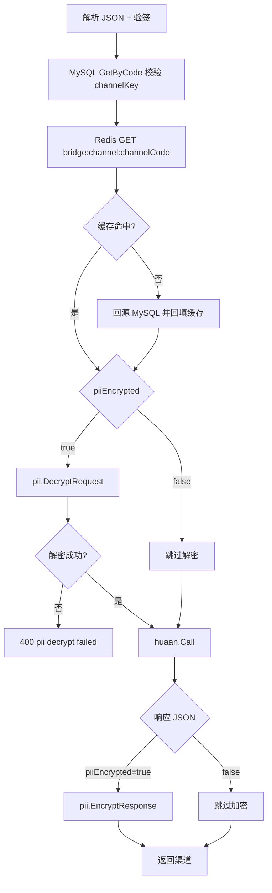

# 渠道三要素加解密开关方案

> **状态**：方案设计（未编码）  
> **版本**：v0.2  
> **日期**：2026-06-22

本文描述「按渠道控制用户三要素（PII）是否加解密」的设计方案。当前实现中，所有渠道请求/响应均强制走 AES-256-GCM 加解密；本方案在**不改变华安侧明文契约**的前提下，允许特定渠道以明文三要素与本服务交互。

---

## 1. 背景与动机

### 1.1 现状

- 渠道 → 本服务：`phoneNo`、`name`、`idCard`（及 `insuredList` 内相关字段）须 **AES-256-GCM + Base64** 密文。
- 本服务 → 华安：三要素 **明文**（符合华安文档）。
- 本服务 → 渠道：响应 `data` 内 PII 字段 **重新加密** 后返回。

编排入口：`ProxyService.Forward`（`internal/service/proxy.go`），PII 转换由 `pii.Transformer`（`internal/pkg/pii/transform.go`）完成。

### 1.2 诉求

部分渠道在联调或接入初期难以实现客户端加解密，希望本服务支持：

- **开启**（默认）：走现有解密/加密流程；
- **关闭**：渠道以明文提交三要素，本服务**不解密、不加密**，直接转发华安并原样返回响应中的 PII。

### 1.3 非性能驱动

本机 benchmark（3 个三要素字段，AES-256-GCM）：

| 操作 | 耗时（约） |
|------|-----------|
| 请求解密 | ~0.5 μs |
| 响应加密 | ~1.6 μs |
| 往返合计 | ~3.8 μs |

相对华安 HTTP（通常 **200ms～数秒**）、MySQL/Redis（**1～5ms**），PII 加解密可忽略。**本方案不以性能优化为目标**，主要降低特定渠道的接入成本。

---

## 2. 目标与非目标

### 2.1 目标

| # | 目标 |
|---|------|
| G1 | 支持**按渠道**独立配置是否要求三要素加解密 |
| G2 | 配置关闭时，请求/响应 PII **对称**处理（均明文），行为与华安文档字段一致 |
| G3 | 默认行为与现网一致（新渠道、存量渠道均为「要求加密」） |
| G4 | 管理后台可查看、创建、修改该开关 |
| G5 | 渠道商文档可明确该渠道是否须加密 |
| G6 | 渠道 API 按 `channelCode` 从 **Redis 缓存** 读取 `piiEncrypted`，避免每次查库 |
| G7 | 管理后台创建/修改/删除渠道时 **同步更新** Redis 渠道配置缓存 |

### 2.2 非目标

| # | 非目标 |
|---|--------|
| N1 | 不改变华安上游契约（华安侧始终明文） |
| N2 | 不提供全局「一键关闭所有渠道 PII 加密」的生产开关（避免误操作） |
| N3 | 不支持同一渠道「请求明文、响应密文」等混合模式 |
| N4 | 不改造签名算法本身（仍对 JSON 中**实际提交的值**计算 sign） |
| N5 | 本次不实现渠道商自助查询接口（可通过运营/文档告知） |

---

## 3. 方案选型

### 3.1 按渠道 vs 全局配置

| 维度 | 按渠道（推荐） | 全局配置 |
|------|----------------|----------|
| 多渠道并存 | 渠道 A 加密、渠道 B 明文，互不影响 | 一刀切，影响所有渠道 |
| 安全风险 | 可限定少数测试/内网渠道 | 误关则全量 PII 明文 |
| 运营 | 创建渠道时指定，可审计 | 改 env 即生效，难追溯 |
| 与现有模型 | 自然落在 `channels` 表 | 需额外约定与渠道配置的优先级 |

**结论：采用按渠道配置**，字段挂载在 `channels` 表，**不设**生产可用的全局关闭开关。

### 3.2 字段命名

| 项 | 值 |
|----|-----|
| 数据库列 | `pii_encrypted` |
| Go / JSON | `piiEncrypted` |
| 类型 | `TINYINT(1)` / `bool` |
| 默认值 | `1`（true，要求加密） |
| 语义 | `true`：渠道须密文；`false`：渠道可明文 |

---

## 4. 功能设计

### 4.1 行为矩阵

| `piiEncrypted` | 渠道请求三要素 | 转发华安 | 华安响应 PII | 返回渠道 |
|----------------|----------------|----------|--------------|----------|
| `true`（默认） | 须密文 | 解密后明文 | 明文 | 加密后密文 |
| `false` | 明文 | 原样明文 | 明文 | 原样明文 |

### 4.2 渠道配置缓存（Redis）

渠道 API 侧根据请求体中的 `channelCode`，从 Redis 读取该渠道是否要求三要素加解密；**管理后台变更渠道时负责维护缓存一致性**。

| 项 | 说明 |
|----|------|
| Redis 键 | `bridge:channel:{channelCode}` |
| 值（JSON 示例） | `{"piiEncrypted":true,"channelKey":"...","status":1}` |
| 最小字段 | `piiEncrypted`（bool） |
| TTL | 不过期（`0`），由 CRUD 与启动预热维护 |
| 新建渠道默认值 | `piiEncrypted: true` |

#### 4.2.1 缓存生命周期

| 事件 | 动作 |
|------|------|
| 服务启动 | 从 `channels` 表加载全部**启用**渠道，写入 Redis（预热） |
| `POST /admin/api/channels` 创建 | 写 MySQL → `SET bridge:channel:{channelCode}`；未传 `piiEncrypted` 时写 `true` |
| `PUT /admin/api/channels/:id` 修改 | 写 MySQL → 若 `channelCode` 变更则 `DEL` 旧键 → `SET` 新键 |
| `DELETE /admin/api/channels/:id` 删除 | 删 MySQL → `DEL bridge:channel:{channelCode}` |
| 渠道 API 请求 | 验签后 `GET bridge:channel:{channelCode}` 取 `piiEncrypted` |
| 缓存未命中 | 回源 `channels` 表；查到则回填 Redis；查不到则按现网逻辑返回 `invalid channel` |

#### 4.2.2 建议代码位置

| 模块 | 职责 |
|------|------|
| `internal/pkg/redis/channel.go` | `ChannelCache`：`Get` / `Set` / `Delete` / `WarmFromDB` |
| `internal/service/admin.go` | `CreateChannel` / `UpdateChannel` / `DeleteChannel` 成功后调用缓存同步 |
| `cmd/server/main.go` | 启动时调用 `WarmFromDB` |
| `internal/service/proxy.go` | `Forward` 及 bank list 路径：按 `channelCode` 读缓存决定 PII 分支 |

### 4.3 请求处理流程（`ProxyService.Forward`）



**须同步调整的路径**（当前均无条件调用 `EncryptResponse`）：

1. `Forward` 主流程（华安实时响应）
2. `respondBankListFromCache`（Redis 命中）
3. `respondBankListFromDB`（数据库命中）

`getBankList` 在无三要素字段时，开关对功能无实质影响，但仍须保持三条路径逻辑一致，避免未来响应含 PII 时行为分裂。

### 4.4 签名规则（不变）

- `sign` 仍对请求体参与签名的字段按 **ASCII 排序 `k=v&...` + MD5** 计算。
- **`piiEncrypted=true`**：签名使用密文字符串（与 JSON 提交值一致）。
- **`piiEncrypted=false`**：签名使用明文字符串。

渠道商须按所属渠道的开关状态选择加密后再签名，或明文直接签名。

### 4.5 涉及 PII 的接口

与 [CHANNEL_API.md](./CHANNEL_API.md) 一致，下列接口在 `piiEncrypted=true` 时三要素须密文；`false` 时须明文：

| 接口 | 请求三要素 | 响应三要素 |
|------|------------|------------|
| verifyNoCode | 是 | 是 |
| getPolicyInfoByPhoneNo | 是（phoneNo） | 是 |
| product/info | 是（phoneNo） | 否 |
| sms/send | 是（phoneNo） | 否 |
| sms/valid | 是（mobile） | 是（phoneNo、name、idCard） |
| sms/noValid | 是（mobile） | 是（phoneNo、name、idCard） |
| priceByUser | 是（idCard） | 否 |
| policy/phone | 是（phoneNo，与 userId 二选一） | 是（data[]、insuredList 等） |
| getUserInfoByPhoneNo | 是（phoneNo，与 userId 二选一） | 是（phoneNo、name、idCard） |
| getLiabilitiesByProductId | 是（idCard） | 否 |
| getProductPricesByProductCode | 是 | 否 |
| proInsurance | 是 | 否 |
| getSignUrl | 是 | 否 |
| getProductPricesByPolicyId | 否 | 否 |
| getPolicyInfoByPolicyId | 否 | 是（insuredList 等） |

不涉及三要素的接口（如 `getBankList`、`getProductInfoByChannel`）不受开关实质影响。

### 4.6 错误码（不变）

| code | message | 说明 |
|------|---------|------|
| 400 | `pii decrypt failed` | 仅 `piiEncrypted=true` 且顶层三要素解密失败时返回 |

`piiEncrypted=false` 时不调用解密，不会产生此错误。

---

## 5. 数据模型

### 5.1 表结构变更

**表**：`channels`

```sql
ALTER TABLE channels
  ADD COLUMN pii_encrypted TINYINT(1) NOT NULL DEFAULT 1
  COMMENT '1=渠道三要素须 AES 加密；0=明文'
  AFTER status;
```

### 5.2 Go 模型（`internal/model/models.go`）

```go
PiiEncrypted bool `gorm:"column:pii_encrypted;not null;default:true" json:"piiEncrypted"`
```

### 5.3 存量数据

- 迁移后所有既有渠道 `pii_encrypted = 1`，行为与现网一致。
- 无需数据回填或渠道侧改造。

---

## 6. 管理后台

管理后台是渠道配置缓存的**唯一写入口**（除启动预热与 API 回源回填外）。任何渠道的创建、修改、删除都必须同步 Redis，确保 API 侧读到的 `piiEncrypted` 与数据库一致。

### 6.1 API 变更

现有渠道 CRUD 已绑定 `model.Channel`，扩展 JSON 字段即可：

| 接口 | 变更 | 缓存副作用 |
|------|------|------------|
| `GET /admin/api/channels` | 响应增加 `piiEncrypted` | 无 |
| `POST /admin/api/channels` | 请求可传 `piiEncrypted`，**缺省 `true`** | `SET bridge:channel:{channelCode}` |
| `PUT /admin/api/channels/:id` | 可更新 `piiEncrypted`；若改 `channelCode` 须换键 | `DEL` 旧键（如有）+ `SET` 新键 |
| `DELETE /admin/api/channels/:id` | 删除渠道 | `DEL bridge:channel:{channelCode}` |

同步更新 `api/openapi.yaml` 中 `Channel` schema。

**创建渠道默认值**（须同时满足）：

1. 数据库列 `pii_encrypted` 默认 `1`
2. API 未传 `piiEncrypted` 时，服务端置 `true`
3. 写入 Redis 缓存时 `piiEncrypted: true`
4. 管理后台表单默认勾选「三要素加密」

### 6.2 前端（`web/admin/src/views/ChannelsView.vue`）

- 列表列：显示「三要素加密：是/否」。
- 创建/编辑表单：开关或下拉，**默认开启**。
- 关闭时二次确认，提示：

  > 关闭后该渠道将以明文传输手机号、姓名、身份证号。请确认渠道与本服务之间已有 HTTPS 或专线等传输保护，且仅用于联调或可信内网环境。

### 6.3 权限与审计

- 与现有渠道管理相同，需管理员 JWT。
- 变更 `piiEncrypted` 或删除渠道时记 **info 日志**（channelCode、操作类型、旧值→新值），不记 PII 内容。
- 缓存同步失败时应返回 5xx 或重试，**避免 DB 已更新而 Redis 仍为旧值**；具体策略编码时二选一：事务性「先 DB 后 Redis，失败则告警」或「DB 成功后 Redis 失败则 API 报错并提示重试」。

---

## 7. 安全与合规

### 7.1 风险

| 风险 | 说明 | 缓解 |
|------|------|------|
| 传输明文 PII | 渠道↔本服务段可见明文三要素 | 默认开启加密；关闭仅限明确审批的渠道；依赖 HTTPS/Nginx TLS |
| 误配置 | 生产渠道被设为明文 | 管理后台二次确认；关闭项在列表中高亮 |
| 日志泄露 | 服务日志记录 body | 现网已不记录 body；方案不改动日志策略 |
| 合规 | 个人信息保护法 | 明文模式需业务/法务确认使用范围 |

### 7.2 建议使用场景

| 场景 | 建议 `piiEncrypted` |
|------|---------------------|
| 生产正式渠道 | `true`（强制） |
| 测试环境联调 | `false` 可接受（若链路有 TLS） |
| 内网渠道、暂无法做 AES 的老系统 | 个案评估后 `false` |
| 公网无 TLS 渠道 | **禁止** `false` |

### 7.3 不提供的能力

- **全局 env 关闭 PII 加密**：不在本方案范围内，避免单次配置影响全部渠道。
- 可选后续：仅测试环境通过启动检查拒绝 `pii_encrypted=0` 的渠道（硬约束），本次不实现。

---

## 8. 性能评估

关闭 PII 加解密每请求节省约 **4 μs**，占典型请求（≥200ms）的 **< 0.002%**。

**结论：性能不是实施或拒绝本方案的依据。**

---

## 9. 兼容性与迁移

### 9.1 向后兼容

- 默认 `piiEncrypted=true`，存量渠道与已对接 SDK **零改动**。
- 新字段对渠道 API 请求体**不可见**（仍仅传 `channelCode` 等，开关由服务端按渠道配置决定）。

### 9.2 切换开关时的注意事项

渠道侧须与运营同步切换：

1. 运营在管理后台修改 `piiEncrypted`；
2. 渠道调整请求：加密↔明文，并**重新按新值计算 sign**；
3. 建议在低峰期切换，切换后立即用 `verifyNoCode` 等接口验证。

不支持「同一渠道同时接受明文与密文自动识别」——避免歧义与签名不一致。当前 `DecryptRequest` 对嵌套字段有「解密失败则跳过」的兼容逻辑，**正式方案中 `piiEncrypted=true` 时顶层仍严格解密失败即 400**；`false` 时整体跳过解密，不尝试解密。

### 9.3 部署顺序

1. 执行 DB 迁移（加列，默认 1）
2. 部署后端（读新字段，默认 true）
3. 部署管理后台
4. 更新渠道文档
5. 按需为特定测试渠道设为 `false`

---

## 10. 测试计划

### 10.1 单元测试

| 用例 | 说明 |
|------|------|
| 创建渠道未传 `piiEncrypted` | DB 与 Redis 均为 `true` |
| 修改 `piiEncrypted` false→true | Redis 立即更新，下一请求走加解密 |
| 修改 `channelCode` | 旧 Redis 键删除，新键写入 |
| 删除渠道 | Redis 键删除；该 `channelCode` 请求失败 |
| 缓存未命中 | 回源 MySQL 并回填，行为与命中一致 |
| `piiEncrypted=true` + 密文请求 | 与现网一致，解密成功转发 |
| `piiEncrypted=true` + 明文请求 | 400 `pii decrypt failed` |
| `piiEncrypted=false` + 明文请求 | 不解密，华安收到明文 |
| 响应加密 | true 时 data 内 PII 为 Base64；false 时为明文 |
| getBankList 缓存路径 | 两种开关下 EncryptResponse 调用与否正确 |

### 10.2 集成 / 手工

- 管理后台创建 `piiEncrypted=false` 渠道，用 `scripts/channel_sim` 变体（明文模式）跑 10 接口。
- 对比 `piiEncrypted=true` 渠道同一接口，确认仅 PII 形态不同、业务 code 一致。

### 10.3 回归

- 默认 true 的存量渠道全套回归签名 + 加解密。

---

## 11. 文档与契约同步清单（编码阶段）

| 文件 | 变更 | 状态 |
|------|------|------|
| [docs/PII_CHANNEL_ENCRYPTION.md](./PII_CHANNEL_ENCRYPTION.md) | 本方案文档 | v0.2 已更新 |
| [docs/ARCHITECTURE.md](./ARCHITECTURE.md) | §2.4 渠道配置缓存、§4 PII 流转 | 已更新 |
| [docs/CHANNEL_API.md](./CHANNEL_API.md) | §1 接入准备、§2.4 PII 按渠道说明 | 已更新 |
| [docs/TESTING.md](./TESTING.md) | 增加明文渠道联调、缓存一致性测试步骤 | 待编码时补充 |
| [api/openapi.yaml](./api/openapi.yaml) | Channel schema + 管理 API 描述 | 待编码 |
| [README.md](../README.md) | 功能概览与渠道接入说明 | 已更新 |

---

## 12. 实现清单（后续编码）

| 序号 | 模块 | 任务 |
|------|------|------|
| 1 | SQL / 迁移 | `channels.pii_encrypted` 加列，默认 `1` |
| 2 | `internal/model` | `Channel.PiiEncrypted` |
| 3 | `internal/pkg/redis/channel.go` | `ChannelCache`：Get / Set / Delete / WarmFromDB |
| 4 | `internal/service/admin` | CRUD 后同步 Redis；`CreateChannel` 默认 `PiiEncrypted=true` |
| 5 | `cmd/server/main.go` | 启动预热渠道缓存 |
| 6 | `internal/service/proxy` | 按 `channelCode` 读缓存 `piiEncrypted`；未命中回源回填 |
| 7 | `web/admin` | 渠道列表与表单，默认开启加密 |
| 8 | 测试 | 见 §10 |
| 9 | 文档 / OpenAPI | 见 §11 |

**预估改动规模**：约 10～14 个文件，核心 diff 集中在 `redis/channel.go`、`admin.go`、`proxy.go`、model、管理后台表单与迁移 SQL。

---

## 13. 决策摘要

| 问题 | 决策 |
|------|------|
| 是否需要该能力？ | **需要**，但仅限按渠道、接入降本场景，非性能 |
| 配置粒度 | **按渠道** `channels.pii_encrypted` |
| 运行时读取 | **Redis** `bridge:channel:{channelCode}` → `piiEncrypted` |
| 缓存维护 | 管理后台 **创建/修改/删除** 渠道时同步更新 Redis；启动预热 |
| 默认值 | **true**（要求加密），新建渠道显式默认 |
| 全局关闭 | **不提供** |
| 请求/响应 | **对称**：开则加解密，关则均明文 |
| 性能影响 | 可忽略 |

---

## 14. 附录：与现网代码对照

| 现网行为 | 代码位置 |
|----------|----------|
| 无条件解密请求 | `proxy.go` L99–102 |
| 无条件加密响应 | `proxy.go` L125；L211；L242 |
| 顶层解密失败 → 400 | `pii/transform.go` `DecryptRequest` |
| 渠道配置查库（验签） | `proxy.go` L76–79 `channels.GetByCode` |
| 渠道 CRUD（无缓存） | `admin.go` `CreateChannel` / `UpdateChannel` / `DeleteChannel` |
| 银行列表 Redis 缓存（参考实现） | `internal/pkg/redis/banklist.go` |

**改造后**：

- `piiEncrypted`：在验签通过后，由 `ChannelCache.Get(channelCode)` 读取（未命中回源 DB 并 `Set`）。
- 管理后台渠道 CRUD：在 DB 操作成功后调用 `ChannelCache.Set` 或 `Delete`。
- 开关分支：在读到 `piiEncrypted` 之后、调用 `DecryptRequest` / `EncryptResponse` 之前。
