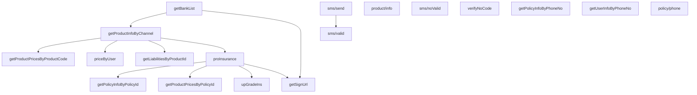

# 华安侧接口请求与响应

本文档记录在本机通过 `huaan.Client` 逻辑**直连华安**（不经渠道验签、三要素**明文**）的实测结果。

## 测试环境

| 项 | 值 |
|----|-----|
| 华安地址 | `https://ins.api.hahealth.ink/` |
| 渠道编码 | `I7fZcM` |
| 测试时间 | 2026-06-26T12:22:34+08:00 |
| 签名 | 关闭（`key`/`sign` 为空字符串） |
| hahealth 适配 | 请求头 `channelCode`；`/upChannelApi/*` 映射为 `/proxy/upChannelApi/*`；`/common/channel/api/*` 附加请求头 `timestamp` |
| 探测脚本 | `go run ./scripts/huaan_direct_probe/main.go` |

三要素测试账号（文档脱敏为 `***`）：手机号、姓名、身份证号来自 `HUAAN_TEST_*` 环境变量。

## 接口依赖与调用顺序



| 阶段 | 接口 | 依赖参数来源 |
|------|------|--------------|
| 1 | getBankList | 无 |
| 1 | getProductInfoByChannel | 无 |
| 2 | product/info、sms/send、sms/noValid、verifyNoCode、getPolicyInfoByPhoneNo、getUserInfoByPhoneNo、policy/phone | 测试环境三要素/手机号 |
| 3 | getProductPricesByProductCode、priceByUser、getLiabilitiesByProductId | `productCode` ← getProductInfoByChannel；失败时用 `HUAAN_TEST_PRODUCT_CODE` 种子值 |
| 4 | sms/valid | `smsCode` ← 真实短信或 `HUAAN_TEST_SMS_CODE` |
| 5 | proInsurance | `productCode` + 三要素 |
| 6 | getPolicyInfoByPolicyId、getProductPricesByPolicyId、upGradeIns | `policyId` ← proInsurance |
| 7 | getSignUrl | `policyId`/`userId` ← proInsurance；`bankCode`/`payChannelId` ← getBankList |

## 接口明细

### 1. getBankList — 成功

| 项 | 值 |
|----|-----|
| 渠道路径 | `POST /upChannelApi/getBankList` |
| 华安路径 | `POST https://ins.api.hahealth.ink/common/channel/api/getBankList` |
| 业务码 | `200` |
| 耗时 | 135 ms |
| 说明 | 无业务参数 |

**请求体**（`key`/`sign` 由客户端注入，下表为业务字段 + 公共字段）：

```json
{
  "channelCode": "I7fZcM",
  "timestamp": "1782447754917",
  "key": "",
  "sign": ""
}
```

**响应体**：

```json
{
  "code": 200,
  "message": "",
  "data": [
    {
      "bankName": "建设银行",
      "bankCode": "CCB",
      "debitCard": "1",
      "creditCard": "1",
      "sortOrder": 1,
      "payChannelId": "ef70a5a2afea440d86c9a804d0458736",
      "isActBank": "0",
      "activityScore": null
    },
    {
      "bankName": "农业银行",
      "bankCode": "ABC",
      "debitCard": "1",
      "creditCard": "1",
      "sortOrder": 4,
      "payChannelId": "ef70a5a2afea440d86c9a804d0458736",
      "isActBank": "0",
      "activityScore": null
    },
    {
      "bankName": "邮储银行",
      "bankCode": "PSBC",
      "debitCard": "1",
      "creditCard": "0",
      "sortOrder": 5,
      "payChannelId": "4bf5dd6ece6847e68ee6c5d4345afee4",
      "isActBank": "0",
      "activityScore": null
    },
    {
      "bankName": "中国银行",
      "bankCode": "BOC",
      "debitCard": "1",
      "creditCard": "0",
      "sortOrder": 6,
      "payChannelId": "4bf5dd6ece6847e68ee6c5d4345afee4",
      "isActBank": "0",
      "activityScore": null
    },
    {
      "bankName": "华夏银行",
      "bankCode": "HX",
      "debitCard": "1",
      "creditCard": "1",
      "sortOrder": 6,
      "payChannelId": "4bf5dd6ece6847e68ee6c5d4345afee4",
      "isActBank": "0",
      "activityScore": null
    },
    {
      "bankName": "平安银行",
      "bankCode": "SZPA",
      "debitCard": "1",
      "creditCard": "1",
      "sortOrder": 7,
      "payChannelId": "4bf5dd6ece6847e68ee6c5d4345afee4",
      "isActBank": "0",
      "activityScore": null
    },
    {
      "bankName": "中信银行",
      "bankCode": "ECITIC",
      "debitCard": "1",
      "creditCard": "1",
      "sortOrder": 8,
      "payChannelId": "4bf5dd6ece6847e68ee6c5d4345afee4",
      "isActBank": "0",
      "activityScore": null
    },
    {
      "bankName": "广发银行",
      "bankCode": "GDB",
      "debitCard": "1",
      "creditCard": "1",
      "sortOrder": 9,
      "payChannelId": "4bf5dd6ece6847e68ee6c5d4345afee4",
      "isActBank": "0",
      "activityScore": null
    },
    {
      "bankName": "北京银行",
      "bankCode": "BCCB",
      "debitCard": "1",
      "creditCard": "0",
      "sortOrder": 10,
      "payChannelId": "4bf5dd6ece6847e68ee6c5d4345afee4",
      "isActBank": "0",
      "activityScore": null
    },
    {
      "bankName": "青岛银行",
      "bankCode": "QDYH",
      "debitCard": "1",
      "creditCard": "1",
      "sortOrder": 12,
      "payChannelId": "4bf5dd6ece6847e68ee6c5d4345afee4",
      "isActBank": "0",
      "activityScore": null
    },
    {
      "bankName": "浦发银行",
      "bankCode": "SPDB",
      "debitCard": "1",
      "creditCard": "1",
      "sortOrder": 13,
      "payChannelId": "4bf5dd6ece6847e68ee6c5d4345afee4",
      "isActBank": "0",
      "activityScore": null
    },
    {
      "bankName": "上海银行",
      "bankCode": "SHB",
      "debitCard": "1",
      "creditCard": "1",
      "sortOrder": 14,
      "payChannelId": "4bf5dd6ece6847e68ee6c5d4345afee4",
      "isActBank": "0",
      "activityScore": null
    },
    {
      "bankName": "光大银行",
      "bankCode": "CEB",
      "debitCard": "1",
      "creditCard": "0",
      "sortOrder": 15,
      "payChannelId": "4bf5dd6ece6847e68ee6c5d4345afee4",
      "isActBank": "0",
      "activityScore": null
    },
    {
      "bankName": "南京银行",
      "bankCode": "NJCB",
      "debitCard": "1",
      "creditCard": "0",
      "sortOrder": 16,
      "payChannelId": "4bf5dd6ece6847e68ee6c5d4345afee4",
      "isActBank": "0",
      "activityScore": null
    },
    {
      "bankName": "恒丰银行",
      "bankCode": "HFB",
      "debitCard": "1",
      "creditCard": "0",
      "sortOrder": 17,
      "payChannelId": "4bf5dd6ece6847e68ee6c5d4345afee4",
      "isActBank": "0",
      "activityScore": null
    },
    {
      "bankName": "兴业银行",
      "bankCode": "CIB",
      "debitCard": "1",
      "creditCard": "0",
      "sortOrder": 18,
      "payChannelId": "4bf5dd6ece6847e68ee6c5d4345afee4",
      "isActBank": "0",
      "activityScore": null
    },
    {
      "bankName": "民生银行",
      "bankCode": "CMBCHINA",
      "debitCard": "1",
      "creditCard": "0",
      "sortOrder": 19,
      "payChannelId": "4bf5dd6ece6847e68ee6c5d4345afee4",
      "isActBank": "0",
      "activityScore": null
    }
  ]
}
```

### 2. getProductInfoByChannel — 失败

| 项 | 值 |
|----|-----|
| 渠道路径 | `POST /upChannelApi/getProductInfoByChannel` |
| 华安路径 | `POST https://ins.api.hahealth.ink/proxy/upChannelApi/getProductInfoByChannel` |
| 业务码 | `500` |
| 耗时 | 46 ms |
| 说明 | 无业务参数；正常情况下 productCode 取自本接口 |

**请求体**（`key`/`sign` 由客户端注入，下表为业务字段 + 公共字段）：

```json
{
  "channelCode": "I7fZcM",
  "timestamp": "1782447755052",
  "key": "",
  "sign": ""
}
```

**响应体**：

```json
{
  "code": 500,
  "message": "无效的证件信息",
  "data": null
}
```

### 3. product/info — 失败

| 项 | 值 |
|----|-----|
| 渠道路径 | `POST /upChannelApi/product/info` |
| 华安路径 | `POST https://ins.api.hahealth.ink/common/channel/api/product/info` |
| 业务码 | `601` |
| 耗时 | 44 ms |
| 说明 | 三要素明文 |

**请求体**（`key`/`sign` 由客户端注入，下表为业务字段 + 公共字段）：

```json
{
  "channelCode": "I7fZcM",
  "idCard": "***",
  "name": "***",
  "phoneNo": "***",
  "timestamp": "1782447755099",
  "key": "",
  "sign": ""
}
```

**响应体**：

```json
{
  "code": 601,
  "message": null,
  "data": null
}
```

### 4. sms/send — 失败

| 项 | 值 |
|----|-----|
| 渠道路径 | `POST /upChannelApi/sms/send` |
| 华安路径 | `POST https://ins.api.hahealth.ink/common/channel/api/sms/send` |
| 业务码 | `601` |
| 耗时 | 57 ms |
| 说明 | 三要素明文 |

**请求体**（`key`/`sign` 由客户端注入，下表为业务字段 + 公共字段）：

```json
{
  "channelCode": "I7fZcM",
  "idCard": "***",
  "name": "***",
  "phoneNo": "***",
  "timestamp": "1782447755143",
  "key": "",
  "sign": ""
}
```

**响应体**：

```json
{
  "code": 601,
  "message": null,
  "data": null
}
```

### 5. sms/noValid — 失败

| 项 | 值 |
|----|-----|
| 渠道路径 | `POST /upChannelApi/sms/noValid` |
| 华安路径 | `POST https://ins.api.hahealth.ink/common/channel/api/sms/noValid` |
| 业务码 | `601` |
| 耗时 | 47 ms |
| 说明 | mobile 明文 |

**请求体**（`key`/`sign` 由客户端注入，下表为业务字段 + 公共字段）：

```json
{
  "channelCode": "I7fZcM",
  "mobile": "***",
  "timestamp": "1782447755202",
  "key": "",
  "sign": ""
}
```

**响应体**：

```json
{
  "code": 601,
  "message": null,
  "data": null
}
```

### 6. verifyNoCode — 失败

| 项 | 值 |
|----|-----|
| 渠道路径 | `POST /upChannelApi/verifyNoCode` |
| 华安路径 | `POST https://ins.api.hahealth.ink/proxy/upChannelApi/verifyNoCode` |
| 业务码 | `601` |
| 耗时 | 75 ms |
| 说明 | 三要素明文 |

**请求体**（`key`/`sign` 由客户端注入，下表为业务字段 + 公共字段）：

```json
{
  "channelCode": "I7fZcM",
  "idCard": "***",
  "name": "***",
  "phoneNo": "***",
  "timestamp": "1782447755249",
  "key": "",
  "sign": ""
}
```

**响应体**：

```json
{
  "code": 601,
  "message": null,
  "data": null
}
```

### 7. getPolicyInfoByPhoneNo — 失败

| 项 | 值 |
|----|-----|
| 渠道路径 | `POST /upChannelApi/getPolicyInfoByPhoneNo` |
| 华安路径 | `POST https://ins.api.hahealth.ink/proxy/upChannelApi/getPolicyInfoByPhoneNo` |
| 业务码 | `601` |
| 耗时 | 74 ms |
| 说明 | 三要素明文 |

**请求体**（`key`/`sign` 由客户端注入，下表为业务字段 + 公共字段）：

```json
{
  "channelCode": "I7fZcM",
  "idCard": "***",
  "name": "***",
  "phoneNo": "***",
  "timestamp": "1782447755324",
  "key": "",
  "sign": ""
}
```

**响应体**：

```json
{
  "code": 601,
  "message": null,
  "data": null
}
```

### 8. getUserInfoByPhoneNo — 失败

| 项 | 值 |
|----|-----|
| 渠道路径 | `POST /upChannelApi/getUserInfoByPhoneNo` |
| 华安路径 | `POST https://ins.api.hahealth.ink/common/channel/api/getUserInfoByPhoneNo` |
| 业务码 | `601` |
| 耗时 | 44 ms |
| 说明 | phoneNo 明文 |

**请求体**（`key`/`sign` 由客户端注入，下表为业务字段 + 公共字段）：

```json
{
  "channelCode": "I7fZcM",
  "phoneNo": "***",
  "timestamp": "1782447755399",
  "key": "",
  "sign": ""
}
```

**响应体**：

```json
{
  "code": 601,
  "message": null,
  "data": null
}
```

### 9. policy/phone — 失败

| 项 | 值 |
|----|-----|
| 渠道路径 | `POST /upChannelApi/policy/phone` |
| 华安路径 | `POST https://ins.api.hahealth.ink/common/channel/api/policy/phone` |
| 业务码 | `601` |
| 耗时 | 45 ms |
| 说明 | phoneNo 明文 |

**请求体**（`key`/`sign` 由客户端注入，下表为业务字段 + 公共字段）：

```json
{
  "channelCode": "I7fZcM",
  "phoneNo": "***",
  "timestamp": "1782447755443",
  "key": "",
  "sign": ""
}
```

**响应体**：

```json
{
  "code": 601,
  "message": null,
  "data": null
}
```

### 10. getProductPricesByProductCode — 成功

| 项 | 值 |
|----|-----|
| 渠道路径 | `POST /upChannelApi/getProductPricesByProductCode` |
| 华安路径 | `POST https://ins.api.hahealth.ink/proxy/upChannelApi/getProductPricesByProductCode` |
| 参数依赖 | getProductInfoByChannel 失败，暂用种子 productCode=ZFHLW1040003（来自 HUAAN_TEST_PRODUCT_CODE 或报价反查） |
| 业务码 | `200` |
| 耗时 | 460 ms |
| 说明 | hasSocialSecurity 为字符串；含三要素 |

**请求体**（`key`/`sign` 由客户端注入，下表为业务字段 + 公共字段）：

```json
{
  "channelCode": "I7fZcM",
  "hasSocialSecurity": "1",
  "idCard": "***",
  "name": "***",
  "phoneNo": "***",
  "productCode": "ZFHLW1040003",
  "timestamp": "1782447755488",
  "key": "",
  "sign": ""
}
```

**响应体**：

```json
{
  "code": 200,
  "message": "操作成功",
  "data": [
    {
      "productCode": "ZFHLW1040003",
      "productId": "3ecd3842febd42e2854403d9cfe67c36",
      "price": 0.7,
      "productName": "抗癌险-体验版",
      "productType": "1"
    },
    {
      "productCode": "ZFHLW1040002",
      "productId": "c19338f72a354ab69307381b9647ec47",
      "price": 42.22,
      "productName": "抗癌险-正式版",
      "productType": "2"
    }
  ]
}
```

### 11. priceByUser — 失败

| 项 | 值 |
|----|-----|
| 渠道路径 | `POST /upChannelApi/priceByUser` |
| 华安路径 | `POST https://ins.api.hahealth.ink/common/channel/api/priceByUser` |
| 参数依赖 | getProductInfoByChannel 失败，暂用种子 productCode=ZFHLW1040003（来自 HUAAN_TEST_PRODUCT_CODE 或报价反查） |
| 业务码 | `601` |
| 耗时 | 45 ms |
| 说明 | hasSocialSecurity 为整数 |

**请求体**（`key`/`sign` 由客户端注入，下表为业务字段 + 公共字段）：

```json
{
  "channelCode": "I7fZcM",
  "hasSocialSecurity": 1,
  "idCard": "***",
  "productCode": "ZFHLW1040003",
  "timestamp": "1782447755949",
  "key": "",
  "sign": ""
}
```

**响应体**：

```json
{
  "code": 601,
  "message": null,
  "data": null
}
```

### 12. getLiabilitiesByProductId — 失败

| 项 | 值 |
|----|-----|
| 渠道路径 | `POST /upChannelApi/getLiabilitiesByProductId` |
| 华安路径 | `POST https://ins.api.hahealth.ink/common/channel/api/getLiabilitiesByProductId` |
| 参数依赖 | getProductInfoByChannel 失败，暂用种子 productCode=ZFHLW1040003（来自 HUAAN_TEST_PRODUCT_CODE 或报价反查） |
| 业务码 | `601` |
| 耗时 | 46 ms |
| 说明 | productType 1=体验版 |

**请求体**（`key`/`sign` 由客户端注入，下表为业务字段 + 公共字段）：

```json
{
  "channelCode": "I7fZcM",
  "hasSocialSecurity": 1,
  "idCard": "***",
  "productCode": "ZFHLW1040003",
  "productType": 1,
  "timestamp": "1782447755994",
  "key": "",
  "sign": ""
}
```

**响应体**：

```json
{
  "code": 601,
  "message": null,
  "data": null
}
```

### 13. sms/valid — 失败

| 项 | 值 |
|----|-----|
| 渠道路径 | `POST /upChannelApi/sms/valid` |
| 华安路径 | `POST https://ins.api.hahealth.ink/common/channel/api/sms/valid` |
| 参数依赖 | sms/send |
| 业务码 | `601` |
| 耗时 | 43 ms |
| 说明 | 需真实验证码（未设置 HUAAN_TEST_SMS_CODE） |

**请求体**（`key`/`sign` 由客户端注入，下表为业务字段 + 公共字段）：

```json
{
  "channelCode": "I7fZcM",
  "mobile": "***",
  "smsCode": "",
  "timestamp": "1782447756041",
  "key": "",
  "sign": ""
}
```

**响应体**：

```json
{
  "code": 601,
  "message": null,
  "data": null
}
```

### 14. proInsurance — 失败

| 项 | 值 |
|----|-----|
| 渠道路径 | `POST /upChannelApi/proInsurance` |
| 华安路径 | `POST https://ins.api.hahealth.ink/proxy/upChannelApi/proInsurance` |
| 参数依赖 | getProductInfoByChannel 失败，暂用种子 productCode=ZFHLW1040003（来自 HUAAN_TEST_PRODUCT_CODE 或报价反查） |
| 业务码 | `500` |
| 耗时 | 406 ms |
| 说明 | 成功时返回 policyId/userId |

**请求体**（`key`/`sign` 由客户端注入，下表为业务字段 + 公共字段）：

```json
{
  "autoRenew": 1,
  "channelCode": "I7fZcM",
  "hasSocialSecurity": 1,
  "idCard": "***",
  "isUpgrade": 0,
  "name": "***",
  "phoneNo": "***",
  "productCode": "ZFHLW1040003",
  "timestamp": "1782447756084",
  "key": "",
  "sign": ""
}
```

**响应体**：

```json
{
  "code": 500,
  "message": "预投保失败。null",
  "data": null
}
```

### 15. getPolicyInfoByPolicyId — 失败

| 项 | 值 |
|----|-----|
| 渠道路径 | `POST /upChannelApi/getPolicyInfoByPolicyId` |
| 华安路径 | `POST https://ins.api.hahealth.ink/common/channel/api/getPolicyInfoByPolicyId` |
| 参数依赖 | proInsurance 未成功，policyId 为空 |
| 业务码 | `601` |
| 耗时 | 43 ms |
| 说明 | 仅需 policyId |

**请求体**（`key`/`sign` 由客户端注入，下表为业务字段 + 公共字段）：

```json
{
  "channelCode": "I7fZcM",
  "policyId": "",
  "timestamp": "1782447756490",
  "key": "",
  "sign": ""
}
```

**响应体**：

```json
{
  "code": 601,
  "message": "timestamp 字段的值为空",
  "data": null
}
```

### 16. getProductPricesByPolicyId — 失败

| 项 | 值 |
|----|-----|
| 渠道路径 | `POST /upChannelApi/getProductPricesByPolicyId` |
| 华安路径 | `POST https://ins.api.hahealth.ink/common/channel/api/getProductPricesByPolicyId` |
| 参数依赖 | proInsurance 未成功，policyId 为空 |
| 业务码 | `601` |
| 耗时 | 43 ms |
| 说明 | 仅需 policyId |

**请求体**（`key`/`sign` 由客户端注入，下表为业务字段 + 公共字段）：

```json
{
  "channelCode": "I7fZcM",
  "policyId": "",
  "timestamp": "1782447756534",
  "key": "",
  "sign": ""
}
```

**响应体**：

```json
{
  "code": 601,
  "message": "timestamp 字段的值为空",
  "data": null
}
```

### 17. upGradeIns — 失败

| 项 | 值 |
|----|-----|
| 渠道路径 | `POST /upChannelApi/upGradeIns` |
| 华安路径 | `POST https://ins.api.hahealth.ink/proxy/upChannelApi/upGradeIns` |
| 参数依赖 | proInsurance 未成功，policyId 为空 |
| 业务码 | `500` |
| 耗时 | 41 ms |
| 说明 | 仅需 policyId |

**请求体**（`key`/`sign` 由客户端注入，下表为业务字段 + 公共字段）：

```json
{
  "channelCode": "I7fZcM",
  "policyId": "",
  "timestamp": "1782447756577",
  "key": "",
  "sign": ""
}
```

**响应体**：

```json
{
  "code": 500,
  "message": "无效的证件信息",
  "data": null
}
```

### 18. getSignUrl — 失败

| 项 | 值 |
|----|-----|
| 渠道路径 | `POST /upChannelApi/getSignUrl` |
| 华安路径 | `POST https://ins.api.hahealth.ink/proxy/upChannelApi/getSignUrl` |
| 参数依赖 | proInsurance 未成功，policyId 为空; getBankList → bankCode/payChannelId |
| 业务码 | `500` |
| 耗时 | 42 ms |
| 说明 | product=抗癌险-体验版 bank=CCB |

**请求体**（`key`/`sign` 由客户端注入，下表为业务字段 + 公共字段）：

```json
{
  "bankCode": "CCB",
  "cardType": "1",
  "channelCode": "I7fZcM",
  "idCard": "***",
  "name": "***",
  "payChannelId": "ef70a5a2afea440d86c9a804d0458736",
  "phoneNo": "***",
  "policyId": "",
  "timestamp": "1782447756618",
  "userId": "",
  "key": "",
  "sign": ""
}
```

**响应体**：

```json
{
  "code": 500,
  "message": "未找到保单信息",
  "data": null
}
```

## 测试结果汇总

共 **18** 个接口，**2** 个业务成功（`code=200`），**16** 个失败。

### 成功（2）

| 接口 | 华安路径 | 说明 |
|------|----------|------|
| getBankList | `/common/channel/api/getBankList` | — |
| getProductPricesByProductCode | `/proxy/upChannelApi/getProductPricesByProductCode` | 操作成功 |

### 失败（16）

| 接口 | code | message / 原因 |
|------|------|----------------|
| getProductInfoByChannel | 500 | 无效的证件信息；华安返回「无效的证件信息」；无法自动获取 productCode，后续接口改用种子 productCode |
| product/info | 601 | —；/common/channel/api/* 返回 601；可能该环境尚未开通或需额外鉴权 |
| sms/send | 601 | —；同上，common 通道 601 |
| sms/noValid | 601 | —；同上 |
| verifyNoCode | 601 | —；601（proxy 路径） |
| getPolicyInfoByPhoneNo | 601 | —；601 |
| getUserInfoByPhoneNo | 601 | —；common 通道 601 |
| policy/phone | 601 | —；common 通道 601 |
| priceByUser | 601 | —；common 通道 601 |
| getLiabilitiesByProductId | 601 | —；common 通道 601 |
| sms/valid | 601 | —；未提供真实验证码 + common 通道 601 |
| proInsurance | 500 | 预投保失败。null；预投保失败（500）；依赖 productCode，可能与产品/用户状态有关 |
| getPolicyInfoByPolicyId | 601 | timestamp 字段的值为空；proInsurance 未成功，policyId 为空；且返回 timestamp 校验错误 |
| getProductPricesByPolicyId | 601 | timestamp 字段的值为空；policyId 为空 |
| upGradeIns | 500 | 无效的证件信息；policyId 无效 →「无效的证件信息」 |
| getSignUrl | 500 | 未找到保单信息；无有效 policyId →「未找到保单信息」 |

### 结论与后续

1. **`ins.api.hahealth.ink` 与旧环境路径不同**：多数原 `/upChannelApi/*` 需走 `/proxy/upChannelApi/*`，且必须在 HTTP 请求头携带 `channelCode`。
2. **`/common/channel/api/*` 新接口**（product/info、sms/*、priceByUser 等）在本渠道下均返回 `601`，需与华安确认：渠道是否已开通、是否需开启签名或 IP 白名单。
3. **`getProductInfoByChannel` 失败**导致无法自动拉取产品列表；本次用种子 `productCode=ZFHLW1040003` 完成了 `getProductPricesByProductCode`。
4. **`proInsurance` 失败**使 policyId 链路（查保单、升级、签约）均无法继续；需在华安侧排查预投保失败原因。
5. 复现命令：

```bash
export HUAAN_BASE_URL="https://ins.api.hahealth.ink/"
export HUAAN_CHANNEL_CODE="I7fZcM"
export HUAAN_TEST_PHONE="***"
export HUAAN_TEST_NAME="***"
export HUAAN_TEST_ID_CARD="***"
go run ./scripts/huaan_direct_probe/main.go > probe-result.json
```

## 相关文档

- [TESTING.md](./TESTING.md) — 华安直连集成测试说明
- [HUAAN_API_SAMPLES.md](./HUAAN_API_SAMPLES.md) — 旧环境样例归档
- [internal/huaan/paths.go](../internal/huaan/paths.go) — 路径映射定义