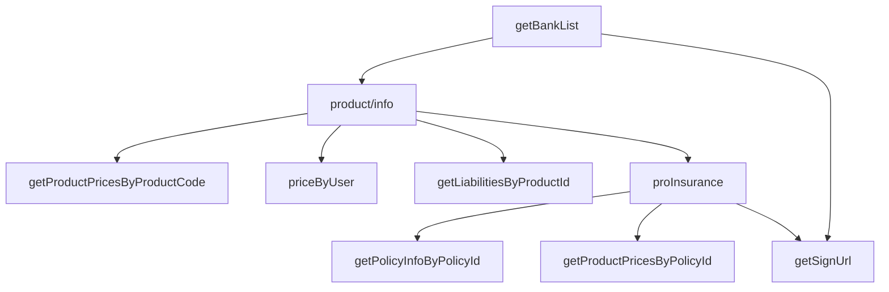

# 华安侧接口请求与响应 [test]

本文档记录**测试环境** `http://47.97.156.18:9040` 直连华安实测（不经渠道验签、三要素**明文**）。

## 测试环境

| 项 | 值 |
|----|-----|
| 华安地址 | `http://47.97.156.18:9040` |
| 渠道编码 | `BLtJjF` |
| 测试时间 | 2026-06-26T17:42:19+08:00 |
| 签名 | **开启**（HTTP 头 `sign`，MD5 大写；密钥不写 body） |
| 请求头 | `/common/channel/api/*` 须附加 `channelCode`、`timestamp`（与 body 一致） |
| 路径 | legacy `/upChannelApi/*` 走 `/proxy/upChannelApi/*` |
| 参数来源 | `productCode` ← **product/info**；`bankCode`/`payChannelId` ← **getBankList** |
| 不测 | sms 系列；**已废弃**：getProductInfoByChannel、verifyNoCode、getPolicyInfoByPhoneNo、upGradeIns |

> 第一套渠道 `adD9Ft` 在本环境报「渠道不存在」；**第二套 `BLtJjF` 联调通过**（见下文）。

## 接口依赖与调用顺序



## 接口明细

### 1. getBankList — 成功

| 项 | 值 |
|----|-----|
| 渠道路径 | `POST /upChannelApi/getBankList` |
| 华安路径 | `POST http://47.97.156.18:9040/common/channel/api/getBankList` |
| 业务码 | `200` |
| 耗时 | 130 ms |
| 说明 | 无业务参数；bankCode/payChannelId 取自本接口 |

**请求体**：

```json
{
  "channelCode": "BLtJjF",
  "timestamp": "1782466939939"
}
```

**请求头**：`sign`、`Content-Type`；common 接口另附 `channelCode`、`timestamp`。

**响应体**：

```json
{
  "code": 200,
  "message": "",
  "data": [
    {
      "bankName": "建设银行",
      "bankCode": "CCB",
      "debitCard": "1",
      "creditCard": "1",
      "sortOrder": 1,
      "payChannelId": "ef70a5a2afea440d86c9a804d0458736",
      "isActBank": "0",
      "activityScore": null
    },
    {
      "bankName": "农业银行",
      "bankCode": "ABC",
      "debitCard": "1",
      "creditCard": "1",
      "sortOrder": 4,
      "payChannelId": "ef70a5a2afea440d86c9a804d0458736",
      "isActBank": "0",
      "activityScore": null
    },
    {
      "bankName": "邮储银行",
      "bankCode": "PSBC",
      "debitCard": "1",
      "creditCard": "0",
      "sortOrder": 5,
      "payChannelId": "4bf5dd6ece6847e68ee6c5d4345afee4",
      "isActBank": "0",
      "activityScore": null
    },
    {
      "bankName": "中国银行",
      "bankCode": "BOC",
      "debitCard": "1",
      "creditCard": "0",
      "sortOrder": 6,
      "payChannelId": "4bf5dd6ece6847e68ee6c5d4345afee4",
      "isActBank": "0",
      "activityScore": null
    },
    {
      "bankName": "华夏银行",
      "bankCode": "HX",
      "debitCard": "1",
      "creditCard": "1",
      "sortOrder": 6,
      "payChannelId": "4bf5dd6ece6847e68ee6c5d4345afee4",
      "isActBank": "0",
      "activityScore": null
    },
    {
      "bankName": "平安银行",
      "bankCode": "SZPA",
      "debitCard": "1",
      "creditCard": "1",
      "sortOrder": 7,
      "payChannelId": "4bf5dd6ece6847e68ee6c5d4345afee4",
      "isActBank": "0",
      "activityScore": null
    },
    {
      "bankName": "中信银行",
      "bankCode": "ECITIC",
      "debitCard": "1",
      "creditCard": "1",
      "sortOrder": 8,
      "payChannelId": "4bf5dd6ece6847e68ee6c5d4345afee4",
      "isActBank": "0",
      "activityScore": null
    },
    {
      "bankName": "广发银行",
      "bankCode": "GDB",
      "debitCard": "1",
      "creditCard": "1",
      "sortOrder": 9,
      "payChannelId": "4bf5dd6ece6847e68ee6c5d4345afee4",
      "isActBank": "0",
      "activityScore": null
    },
    {
      "bankName": "北京银行",
      "bankCode": "BCCB",
      "debitCard": "1",
      "creditCard": "0",
      "sortOrder": 10,
      "payChannelId": "4bf5dd6ece6847e68ee6c5d4345afee4",
      "isActBank": "0",
      "activityScore": null
    },
    {
      "bankName": "青岛银行",
      "bankCode": "QDYH",
      "debitCard": "1",
      "creditCard": "1",
      "sortOrder": 12,
      "payChannelId": "4bf5dd6ece6847e68ee6c5d4345afee4",
      "isActBank": "0",
      "activityScore": null
    },
    {
      "bankName": "浦发银行",
      "bankCode": "SPDB",
      "debitCard": "1",
      "creditCard": "1",
      "sortOrder": 13,
      "payChannelId": "4bf5dd6ece6847e68ee6c5d4345afee4",
      "isActBank": "0",
      "activityScore": null
    },
    {
      "bankName": "上海银行",
      "bankCode": "SHB",
      "debitCard": "1",
      "creditCard": "1",
      "sortOrder": 14,
      "payChannelId": "4bf5dd6ece6847e68ee6c5d4345afee4",
      "isActBank": "0",
      "activityScore": null
    },
    {
      "bankName": "光大银行",
      "bankCode": "CEB",
      "debitCard": "1",
      "creditCard": "0",
      "sortOrder": 15,
      "payChannelId": "4bf5dd6ece6847e68ee6c5d4345afee4",
      "isActBank": "0",
      "activityScore": null
    },
    {
      "bankName": "南京银行",
      "bankCode": "NJCB",
      "debitCard": "1",
      "creditCard": "0",
      "sortOrder": 16,
      "payChannelId": "4bf5dd6ece6847e68ee6c5d4345afee4",
      "isActBank": "0",
      "activityScore": null
    },
    {
      "bankName": "恒丰银行",
      "bankCode": "HFB",
      "debitCard": "1",
      "creditCard": "0",
      "sortOrder": 17,
      "payChannelId": "4bf5dd6ece6847e68ee6c5d4345afee4",
      "isActBank": "0",
      "activityScore": null
    },
    {
      "bankName": "兴业银行",
      "bankCode": "CIB",
      "debitCard": "1",
      "creditCard": "0",
      "sortOrder": 18,
      "payChannelId": "4bf5dd6ece6847e68ee6c5d4345afee4",
      "isActBank": "0",
      "activityScore": null
    },
    {
      "bankName": "民生银行",
      "bankCode": "CMBCHINA",
      "debitCard": "1",
      "creditCard": "0",
      "sortOrder": 19,
      "payChannelId": "4bf5dd6ece6847e68ee6c5d4345afee4",
      "isActBank": "0",
      "activityScore": null
    }
  ]
}
```

### 2. product/info — 成功

| 项 | 值 |
|----|-----|
| 渠道路径 | `POST /upChannelApi/product/info` |
| 华安路径 | `POST http://47.97.156.18:9040/common/channel/api/product/info` |
| 业务码 | `200` |
| 耗时 | 93 ms |
| 说明 | 三要素明文；productCode 取自本接口 |

**请求体**：

```json
{
  "channelCode": "BLtJjF",
  "idCard": "***",
  "name": "***",
  "phoneNo": "***",
  "timestamp": "1782466940072"
}
```

**请求头**：`sign`、`Content-Type`；common 接口另附 `channelCode`、`timestamp`。

**响应体**：

```json
{
  "code": 200,
  "message": "操作成功",
  "data": [
    {
      "productCode": "HuaAnBao",
      "productName": "百万医疗-体验版"
    },
    {
      "productCode": "HuaAnBaoB",
      "productName": "重疾险-体验版"
    }
  ]
}
```

### 3. verifyNoCode — 失败

| 项 | 值 |
|----|-----|
| 渠道路径 | `POST /upChannelApi/verifyNoCode` |
| 华安路径 | `POST http://47.97.156.18:9040/upChannelApi/verifyNoCode` |
| 业务码 | `601` |
| 耗时 | 48 ms |
| 说明 | 三要素明文 |

**请求体**：

```json
{
  "channelCode": "BLtJjF",
  "idCard": "***",
  "name": "***",
  "phoneNo": "***",
  "timestamp": "1782466940168"
}
```

**请求头**：`sign`、`Content-Type`；common 接口另附 `channelCode`、`timestamp`。

**响应体**：

```json
{
  "code": 601,
  "message": null,
  "data": null
}
```

### 4. getPolicyInfoByPhoneNo — 失败

| 项 | 值 |
|----|-----|
| 渠道路径 | `POST /upChannelApi/getPolicyInfoByPhoneNo` |
| 华安路径 | `POST http://47.97.156.18:9040/upChannelApi/getPolicyInfoByPhoneNo` |
| 业务码 | `601` |
| 耗时 | 48 ms |
| 说明 | 三要素明文 |

**请求体**：

```json
{
  "channelCode": "BLtJjF",
  "idCard": "***",
  "name": "***",
  "phoneNo": "***",
  "timestamp": "1782466940221"
}
```

**请求头**：`sign`、`Content-Type`；common 接口另附 `channelCode`、`timestamp`。

**响应体**：

```json
{
  "code": 601,
  "message": null,
  "data": null
}
```

### 5. getUserInfoByPhoneNo — 成功

| 项 | 值 |
|----|-----|
| 渠道路径 | `POST /upChannelApi/getUserInfoByPhoneNo` |
| 华安路径 | `POST http://47.97.156.18:9040/common/channel/api/getUserInfoByPhoneNo` |
| 业务码 | `200` |
| 耗时 | 115 ms |
| 说明 | phoneNo 明文 |

**请求体**：

```json
{
  "channelCode": "BLtJjF",
  "phoneNo": "***",
  "timestamp": "1782466940269"
}
```

**请求头**：`sign`、`Content-Type`；common 接口另附 `channelCode`、`timestamp`。

**响应体**：

```json
{
  "code": 200,
  "message": "操作成功",
  "data": {
    "idCard": "***",
    "name": "***",
    "userId": "***",
    "phoneNo": "***"
  }
}
```

### 6. policy/phone — 成功

| 项 | 值 |
|----|-----|
| 渠道路径 | `POST /upChannelApi/policy/phone` |
| 华安路径 | `POST http://47.97.156.18:9040/common/channel/api/policy/phone` |
| 业务码 | `200` |
| 耗时 | 162 ms |
| 说明 | phoneNo 明文 |

**请求体**：

```json
{
  "channelCode": "BLtJjF",
  "phoneNo": "***",
  "timestamp": "1782466940385"
}
```

**请求头**：`sign`、`Content-Type`；common 接口另附 `channelCode`、`timestamp`。

**响应体**：

```json
{
  "code": 200,
  "message": "操作成功",
  "data": [
    {
      "insuredList": [],
      "productCode": "HuaAnBao",
      "productId": "859db15daa024f43bde30eab9b5f5da2",
      "payPremium": "",
      "riskList": [],
      "isPolicy": "0",
      "policyNo": "",
      "policyStatus": "",
      "productName": "百万医疗-体验版"
    },
    {
      "insuredList": [],
      "productCode": "HuaAnBaoB",
      "productId": "b465c1f3cc4c42ac8033b146fed44f0a",
      "payPremium": "",
      "riskList": [],
      "isPolicy": "0",
      "policyNo": "",
      "policyStatus": "",
      "productName": "重疾险-体验版"
    }
  ]
}
```

### 7. getProductPricesByProductCode — 成功

| 项 | 值 |
|----|-----|
| 渠道路径 | `POST /upChannelApi/getProductPricesByProductCode` |
| 华安路径 | `POST http://47.97.156.18:9040/upChannelApi/getProductPricesByProductCode` |
| 参数依赖 | product/info → productCode=HuaAnBao |
| 业务码 | `200` |
| 耗时 | 1593 ms |
| 说明 | hasSocialSecurity 为字符串；含三要素 |

**请求体**：

```json
{
  "channelCode": "BLtJjF",
  "hasSocialSecurity": "1",
  "idCard": "***",
  "name": "***",
  "phoneNo": "***",
  "productCode": "HuaAnBao",
  "timestamp": "1782466940549"
}
```

**请求头**：`sign`、`Content-Type`；common 接口另附 `channelCode`、`timestamp`。

**响应体**：

```json
{
  "code": 200,
  "message": "操作成功",
  "data": [
    {
      "productCode": "HuaAnBao",
      "productId": "859db15daa024f43bde30eab9b5f5da2",
      "price": 0.6,
      "productName": "百万医疗-体验版",
      "productType": "1"
    },
    {
      "productCode": "HuaAnBao",
      "productId": "d3177469d882467482c58d69aed4972c",
      "price": 155.4,
      "productName": "百万医疗-正式版",
      "productType": "2"
    }
  ]
}
```

### 8. priceByUser — 成功

| 项 | 值 |
|----|-----|
| 渠道路径 | `POST /upChannelApi/priceByUser` |
| 华安路径 | `POST http://47.97.156.18:9040/common/channel/api/priceByUser` |
| 参数依赖 | product/info → productCode=HuaAnBao |
| 业务码 | `200` |
| 耗时 | 166 ms |
| 说明 | hasSocialSecurity 为整数 |

**请求体**：

```json
{
  "channelCode": "BLtJjF",
  "hasSocialSecurity": 1,
  "idCard": "***",
  "productCode": "HuaAnBao",
  "timestamp": "1782466942152"
}
```

**请求头**：`sign`、`Content-Type`；common 接口另附 `channelCode`、`timestamp`。

**响应体**：

```json
{
  "code": 200,
  "message": "操作成功",
  "data": [
    {
      "formalEffectAfterDays": 30,
      "productCode": "HuaAnBao",
      "productId": "859db15daa024f43bde30eab9b5f5da2",
      "price": 0.6,
      "yearPremium": 7.2,
      "expEffectAfterDays": 1,
      "productName": "百万医疗-体验版",
      "productType": "1"
    },
    {
      "formalEffectAfterDays": 30,
      "productCode": "HuaAnBao",
      "productId": "d3177469d882467482c58d69aed4972c",
      "price": 155.4,
      "yearPremium": 1864.8,
      "expEffectAfterDays": 1,
      "productName": "百万医疗-正式版",
      "productType": "2"
    }
  ]
}
```

### 9. getLiabilitiesByProductId — 成功

| 项 | 值 |
|----|-----|
| 渠道路径 | `POST /upChannelApi/getLiabilitiesByProductId` |
| 华安路径 | `POST http://47.97.156.18:9040/common/channel/api/getLiabilitiesByProductId` |
| 参数依赖 | product/info → productCode=HuaAnBao |
| 业务码 | `200` |
| 耗时 | 113 ms |
| 说明 | productType 1=体验版 |

**请求体**：

```json
{
  "channelCode": "BLtJjF",
  "hasSocialSecurity": 1,
  "idCard": "***",
  "productCode": "HuaAnBao",
  "productType": 1,
  "timestamp": "1782466942327"
}
```

**请求头**：`sign`、`Content-Type`；common 接口另附 `channelCode`、`timestamp`。

**响应体**：

```json
{
  "code": 200,
  "message": "操作成功",
  "data": []
}
```

### 10. proInsurance — 成功

| 项 | 值 |
|----|-----|
| 渠道路径 | `POST /upChannelApi/proInsurance` |
| 华安路径 | `POST http://47.97.156.18:9040/proxy/upChannelApi/proInsurance` |
| 参数依赖 | product/info → productCode=HuaAnBao |
| 业务码 | `200` |
| 耗时 | 949 ms |
| 说明 | 成功时返回 policyId/userId |

**请求体**：

```json
{
  "autoRenew": 1,
  "channelCode": "BLtJjF",
  "hasSocialSecurity": 1,
  "idCard": "***",
  "isUpgrade": 0,
  "name": "***",
  "phoneNo": "***",
  "productCode": "HuaAnBao",
  "timestamp": "1782466942442"
}
```

**请求头**：`sign`、`Content-Type`；common 接口另附 `channelCode`、`timestamp`。

**响应体**：

```json
{
  "code": 200,
  "message": "操作成功",
  "data": {
    "policyId": "eae53555f376407bb5b179e992a85029",
    "policyStatus": "0",
    "userId": "***"
  }
}
```

### 11. getPolicyInfoByPolicyId — 成功

| 项 | 值 |
|----|-----|
| 渠道路径 | `POST /upChannelApi/getPolicyInfoByPolicyId` |
| 华安路径 | `POST http://47.97.156.18:9040/common/channel/api/getPolicyInfoByPolicyId` |
| 参数依赖 | proInsurance → policyId=eae53555f376407bb5b179e992a85029 |
| 业务码 | `200` |
| 耗时 | 133 ms |
| 说明 | 仅需 policyId |

**请求体**：

```json
{
  "channelCode": "BLtJjF",
  "policyId": "eae53555f376407bb5b179e992a85029",
  "timestamp": "1782466943391"
}
```

**请求头**：`sign`、`Content-Type`；common 接口另附 `channelCode`、`timestamp`。

**响应体**：

```json
{
  "code": 200,
  "message": "操作成功",
  "data": {
    "insuredList": [
      {
        "insuredCardNo": "13068319940517031X",
        "hasSocialSecurity": "1",
        "insuredName": "杜冲",
        "phoneNo": "***"
      }
    ],
    "optionalRiskList": [],
    "productId": "859db15daa024f43bde30eab9b5f5da2",
    "idCard": "***",
    "hasSocialSecurity": "1",
    "policyEndDate": "2026-07-26",
    "policyStartDate": "2026-06-27",
    "policyStatus": "0",
    "productName": "百万医疗-体验版",
    "phoneNo": "***",
    "productCode": "HuaAnBao",
    "policyId": "eae53555f376407bb5b179e992a85029",
    "payPremium": 0.6,
    "riskList": [
      {
        "riskName": "融盛-百万医疗-体验版-必选责任",
        "riskCode": null
      }
    ],
    "createTime": "2026-06-26",
    "name": "***",
    "autoRenew": "1"
  }
}
```

### 12. getProductPricesByPolicyId — 成功

| 项 | 值 |
|----|-----|
| 渠道路径 | `POST /upChannelApi/getProductPricesByPolicyId` |
| 华安路径 | `POST http://47.97.156.18:9040/common/channel/api/getProductPricesByPolicyId` |
| 参数依赖 | proInsurance → policyId=eae53555f376407bb5b179e992a85029 |
| 业务码 | `200` |
| 耗时 | 119 ms |
| 说明 | 仅需 policyId |

**请求体**：

```json
{
  "channelCode": "BLtJjF",
  "policyId": "eae53555f376407bb5b179e992a85029",
  "timestamp": "1782466943526"
}
```

**请求头**：`sign`、`Content-Type`；common 接口另附 `channelCode`、`timestamp`。

**响应体**：

```json
{
  "code": 200,
  "message": "操作成功",
  "data": {
    "productCode": "HuaAnBao",
    "price": 0.6,
    "historyBinds": [],
    "productName": "百万医疗-体验版"
  }
}
```

### 13. upGradeIns — 失败

| 项 | 值 |
|----|-----|
| 渠道路径 | `POST /upChannelApi/upGradeIns` |
| 华安路径 | `POST http://47.97.156.18:9040/upChannelApi/upGradeIns` |
| 参数依赖 | proInsurance → policyId=eae53555f376407bb5b179e992a85029 |
| 业务码 | `500` |
| 耗时 | 36 ms |
| 说明 | 仅需 policyId |

**请求体**：

```json
{
  "channelCode": "BLtJjF",
  "policyId": "eae53555f376407bb5b179e992a85029",
  "timestamp": "1782466943650"
}
```

**请求头**：`sign`、`Content-Type`；common 接口另附 `channelCode`、`timestamp`。

**响应体**：

```json
{
  "code": 500,
  "message": "无效的证件信息",
  "data": null
}
```

### 14. getSignUrl — 成功

| 项 | 值 |
|----|-----|
| 渠道路径 | `POST /upChannelApi/getSignUrl` |
| 华安路径 | `POST http://47.97.156.18:9040/upChannelApi/getSignUrl` |
| 参数依赖 | proInsurance → policyId=eae53555f376407bb5b179e992a85029; getBankList → bankCode=CCB |
| 业务码 | `200` |
| 耗时 | 1594 ms |
| 说明 | product=百万医疗-体验版 bank=CCB |

**请求体**：

```json
{
  "bankCode": "CCB",
  "cardType": "1",
  "channelCode": "BLtJjF",
  "idCard": "***",
  "name": "***",
  "payChannelId": "ef70a5a2afea440d86c9a804d0458736",
  "phoneNo": "***",
  "policyId": "eae53555f376407bb5b179e992a85029",
  "timestamp": "1782466943687",
  "userId": "***"
}
```

**请求头**：`sign`、`Content-Type`；common 接口另附 `channelCode`、`timestamp`。

**响应体**：

```json
{
  "code": 200,
  "message": "操作成功",
  "data": {
    "signId": "717530454365831168",
    "url": "https://baox.hx-hb.com.cn/sd-i/sign.html?signId=717530454365831168"
  }
}
```

### 15. getProductInfoByChannel — 未执行

| 原因 | 华安侧已废弃，由 product/info 替代 |

### 16. sms/send — 未执行

| 原因 | 按约定不测 sms 系列 |

### 17. sms/noValid — 未执行

| 原因 | 按约定不测 sms 系列 |

### 18. sms/valid — 未执行

| 原因 | 按约定不测 sms 系列 |

## 测试结果汇总

| 已执行 | 14 | 成功 | 11 | 失败 | 3 | 未测 | 4 |

### 成功（11）

| 接口 | code |
|------|------|
| getBankList | 200 |
| product/info | 200 |
| getUserInfoByPhoneNo | 200 |
| policy/phone | 200 |
| getProductPricesByProductCode | 200 |
| priceByUser | 200 |
| getLiabilitiesByProductId | 200 |
| proInsurance | 200 |
| getPolicyInfoByPolicyId | 200 |
| getProductPricesByPolicyId | 200 |
| getSignUrl | 200 |

### 失败（3）

| 接口 | code | message |
|------|------|---------|
| verifyNoCode | 601 | null |
| getPolicyInfoByPhoneNo | 601 | null |
| upGradeIns | 500 | 无效的证件信息 |

### 未执行

- **getProductInfoByChannel**：华安侧已废弃，由 product/info 替代
- **sms/send**：按约定不测 sms 系列
- **sms/noValid**：按约定不测 sms 系列
- **sms/valid**：按约定不测 sms 系列

### 复现命令

```bash
export HUAAN_BASE_URL="http://47.97.156.18:9040"
export HUAAN_CHANNEL_CODE="BLtJjF"
export HUAAN_KEY="***"
export HUAAN_SIGN_ENABLED=true
export HUAAN_PROBE_SKIP_SMS=true
export HUAAN_TEST_PHONE="***"
export HUAAN_TEST_NAME="***"
export HUAAN_TEST_ID_CARD="***"
go run ./scripts/huaan_direct_probe/main.go > probe-test.json
```

## 相关文档

- [华安侧接口请求与响应.md](./华安侧接口请求与响应.md) — hahealth 联调环境
